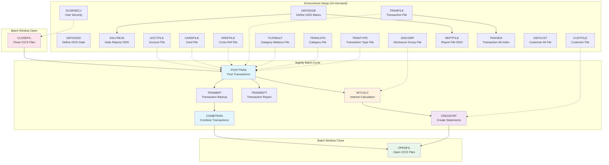

# Batch Processes

This section documents all JCL batch jobs from the CardDemo mainframe application. Each job is documented with its process steps, dependencies, input/output datasets, error handling, and proposed Azure migration target.

**Source system:** IBM z/OS mainframe (CardDemo application)
**Target platform:** Azure Functions (timer triggers), Azure SQL Database, Azure Blob Storage

## Nightly Batch Cycle

The following jobs run daily as part of the nightly batch cycle. They must execute in order due to data dependencies.

| Job | Title | Domain | Schedule | SLA | COBOL Program |
|-----|-------|--------|----------|-----|---------------|
| [POSTTRAN](posttran.md) | Post Transactions | transactions | Daily (nightly) | Before interest calc | CBTRN02C |
| [INTCALC](intcalc.md) | Interest Calculation | billing | Daily 02:00 CET | By 06:00 CET | CBACT04C |
| [COMBTRAN](combtran.md) | Combine Transactions | transactions | Daily (after POSTTRAN) | Before online cycle | SORT/IDCAMS |
| [CREASTMT](creastmt.md) | Create Statements | reporting | Monthly (day 1) | By day 3 | CBSTM03A |
| [TRANBKP](tranbkp.md) | Transaction Backup | transactions | Daily (after POSTTRAN) | Before COMBTRAN | IDCAMS |
| [TRANREPT](tranrept.md) | Transaction Report | reporting | Daily (after POSTTRAN) | N/A | CBTRN03C |

## Batch Window File Management

These jobs coordinate VSAM file access between CICS online processing and batch jobs.

| Job | Title | Domain | Schedule |
|-----|-------|--------|----------|
| [CLOSEFIL](closefil.md) | Close VSAM Files in CICS | account-management | Before batch window |
| [OPENFIL](openfil.md) | Open VSAM Files in CICS | account-management | After batch window |

## Data File Management

These jobs define VSAM clusters, load data from flat files, and build alternate indexes. They run on-demand for initial setup, environment provisioning, or disaster recovery.

| Job | Title | Domain | Key Structure |
|-----|-------|--------|---------------|
| [ACCTFILE](acctfile.md) | Account File Definition/Loading | account-management | KSDS |
| [CARDFILE](cardfile.md) | Card File Definition/Loading | card-management | KSDS |
| [CUSTFILE](custfile.md) | Customer File Definition/Loading | account-management | KSDS |
| [TRANFILE](tranfile.md) | Transaction File Definition/Loading | transactions | KSDS |
| [XREFFILE](xreffile.md) | Cross-Reference File Definition/Loading | card-management | KSDS |
| [REPTFILE](reptfile.md) | Report File GDG Definition | reporting | GDG |
| [TCATBALF](tcatbalf.md) | Transaction Category Balance File | transactions | KSDS |
| [TRANCATG](trancatg.md) | Transaction Category File | transactions | KSDS |
| [TRANTYPE](trantype.md) | Transaction Type File | transactions | KSDS |
| [DISCGRP](discgrp.md) | Disclosure Group File | billing | KSDS |
| [TRANIDX](tranidx.md) | Transaction Alternate Index | transactions | AIX |
| [DALYREJS](dalyrejs.md) | Daily Rejects GDG Definition | transactions | GDG |

## Import/Export and Verification

These jobs export data to or import data from consolidated files, and verify file contents by reading and printing records.

| Job | Title | Domain | COBOL Program |
|-----|-------|--------|---------------|
| [CBEXPORT](cbexport.md) | Data Export | account-management | CBEXPORT |
| [CBIMPORT](cbimport.md) | Data Import | account-management | CBIMPORT |
| [READACCT](readacct.md) | Read Account File | account-management | CBACT01C |
| [READCARD](readcard.md) | Read Card File | card-management | CBACT02C |
| [READCUST](readcust.md) | Read Customer File | account-management | CBCUS01C |
| [READXREF](readxref.md) | Read Cross-Reference File | card-management | CBACT03C |

## Utility and Maintenance

These jobs handle GDG base definitions, security setup, CICS resource definitions, and other infrastructure tasks.

| Job | Title | Domain |
|-----|-------|--------|
| [DEFCUST](defcust.md) | Define Customer File (Alternate) | account-management |
| [DEFGDGB](defgdgb.md) | Define GDG Bases | transactions |
| [DEFGDGD](defgdgd.md) | Define GDG Data (Reference Tables) | transactions |
| [DUSRSECJ](dusrsecj.md) | User Security Definition | account-management |
| [ESDSRRDS](esdsrrds.md) | ESDS/RRDS File Operations | account-management |
| [WAITSTEP](waitstep.md) | Wait Step for Job Scheduling | account-management |
| [CBADMCDJ](cbadmcdj.md) | Admin Card Processing (CICS) | account-management |
| [PRTCATBL](prtcatbl.md) | Print Category Balance | reporting |

## Job Dependency Diagram

The following diagram shows the execution order and data dependencies for the nightly batch cycle and related setup jobs.

**Legend:**
- Solid arrows (`-->`) indicate execution order dependencies within the nightly batch cycle
- Dashed arrows (`-.->`) indicate data dependencies (setup jobs provide data required by batch jobs)
- Blue: Transaction processing, Orange: Billing, Purple: Reporting, Pink/Green: File management

## Azure Migration Mapping

| Mainframe Component | Azure Target |
|---------------------|-------------|
| JCL batch jobs | Azure Functions (timer triggers) |
| VSAM KSDS files | Azure SQL Database tables |
| VSAM ESDS/RRDS files | Azure Blob Storage |
| GDG (Generation Data Groups) | Azure Blob Storage with versioning |
| IDCAMS (REPRO, DELETE, DEFINE) | Azure SQL migrations / Data Factory |
| SORT utility | SQL ORDER BY / Azure Data Factory |
| CICS file open/close | Not applicable (always-on database) |
| COBOL batch programs | C#/.NET 8 Azure Functions |
