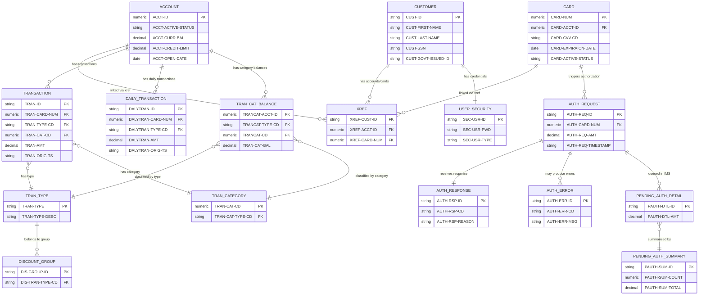

# Data Structures

COBOL copybook definitions and their mapped .NET equivalents.

## Documented Copybooks

### Account Management

| Copybook | Record Length | Key | Business Rule | Purpose |
|----------|-------------|-----|---------------|---------|
| [`CVACT01Y.cpy`](./CVACT01Y) | 300 bytes | ACCT-ID PIC 9(11) | [ACCT-BR-001](../business-rules/account-management/acct-br-001) | Account master record layout |
| [`CVACT02Y.cpy`](./CVACT02Y) | 150 bytes | CARD-NUM PIC X(16) | [ACCT-BR-009](../business-rules/account-management/acct-br-009) | Card record layout |
| [`CVACT03Y.cpy`](./CVACT03Y) | 50 bytes | XREF-CARD-NUM PIC X(16) | [ACCT-BR-009](../business-rules/account-management/acct-br-009) | Card-customer-account cross-reference |
| [`CVCRD01Y.cpy`](./cvcrd01y) | N/A (work area) | N/A | N/A | Card work area (AID keys, screen fields) |
| [`CVCUS01Y.cpy`](./cvcus01y) | 500 bytes | CUST-ID | N/A | Customer record |
| [`CVEXPORT.cpy`](./cvexport) | 500 bytes | N/A | N/A | Export record (multi-format data export) |
| [`CUSTREC.cpy`](./DS-CUST-002) | 500 bytes | N/A | N/A | Customer record (alternate) |

### Card Management

| Copybook | Record Length | Key | Business Rule | Purpose |
|----------|-------------|-----|---------------|---------|
| `CVACT02Y.cpy` | 150 bytes | CARD-NUM PIC X(16) | [CARD-BR-009](../business-rules/card-management/card-br-009) | Card record layout |
| `CVACT03Y.cpy` | 50 bytes | XREF-CARD-NUM PIC X(16) | [CARD-BR-010](../business-rules/card-management/card-br-010) | Card cross-reference structure |
| `CVCRD01Y.cpy` | N/A | N/A | [CARD-BR-011](../business-rules/card-management/card-br-011) | Card work area (AID keys, screen fields) |

### Transactions

| Copybook | Record Length | Key | Business Rule | Purpose |
|----------|-------------|-----|---------------|---------|
| [`CVTRA01Y.cpy`](./cvtra01y) | 50 bytes | N/A | N/A | Transaction category balance record |
| [`CVTRA02Y.cpy`](./cvtra02y) | 50 bytes | N/A | N/A | Discount group record |
| [`CVTRA03Y.cpy`](./cvtra03y) | 60 bytes | N/A | N/A | Transaction type record |
| [`CVTRA04Y.cpy`](./cvtra04y) | 60 bytes | N/A | N/A | Transaction category record |
| [`CVTRA05Y.cpy`](./cvtra05y) | 350 bytes | N/A | N/A | Transaction record |
| [`CVTRA06Y.cpy`](./cvtra06y) | 350 bytes | N/A | N/A | Daily transaction record |
| [`CVTRA07Y.cpy`](./cvtra07y) | N/A (report) | N/A | N/A | Transaction report structures |

## Authorization / IMS Extension Copybooks

Data structures from the IMS/DB2/MQ authorization subsystem (`app/app-authorization-ims-db2-mq/cpy/`) and the transaction type DB2 extension (`app/app-transaction-type-db2/cpy/`). These define the authorization request/response flow, IMS PCB layouts, and pending authorization records.

| ID | Copybook | Title | Domain | Target Table |
|----|----------|-------|--------|-------------|
| [DS-AUTH-REQ-001](./DS-AUTH-REQ-001) | CCPAURQY.cpy | Authorization Request | Authorization | dbo.AuthorizationRequest |
| [DS-AUTH-RSP-001](./DS-AUTH-RSP-001) | CCPAURLY.cpy | Authorization Response | Authorization | dbo.AuthorizationResponse |
| [DS-AUTH-ERR-001](./DS-AUTH-ERR-001) | CCPAUERY.cpy | Authorization Error Log | Authorization | dbo.AuthorizationErrorLog |
| [DS-AUTH-DTL-001](./DS-AUTH-DTL-001) | CIPAUDTY.cpy | IMS Pending Authorization Detail | Authorization | dbo.PendingAuthorizationDetail |
| [DS-AUTH-SUM-001](./DS-AUTH-SUM-001) | CIPAUSMY.cpy | IMS Pending Authorization Summary | Authorization | dbo.PendingAuthorizationSummary |
| [DS-IMS-001](./DS-IMS-001) | IMSFUNCS.cpy | IMS Function Codes | Authorization | N/A (DL/I constants) |
| [DS-PCB-AUT-001](./DS-PCB-AUT-001) | PAUTBPCB.cpy | Auth Base PCB | Authorization | N/A (IMS infrastructure) |
| [DS-PCB-DFL-001](./DS-PCB-DFL-001) | PADFLPCB.cpy | Detail File PCB | Authorization | N/A (IMS infrastructure) |
| [DS-PCB-SFL-001](./DS-PCB-SFL-001) | PASFLPCB.cpy | Summary File PCB | Authorization | N/A (IMS infrastructure) |

## BMS Screen Copybooks

BMS (Basic Mapping Support) copybooks define CICS 3270 terminal screen layouts. These are not database records -- they define the UI fields for the CardDemo online transaction screens. Each has input (AI) and output (AO) record variants.

| ID | Copybook | Title | Domain | Used By |
|----|----------|-------|--------|---------|
| [DS-BMS-ACTUP](./DS-BMS-ACTUP) | COACTUP.CPY | Account Update Screen | UI Screens | COACTUPC |
| [DS-BMS-ACTVW](./DS-BMS-ACTVW) | COACTVW.CPY | Account View Screen | UI Screens | COACTVWC |
| [DS-BMS-ADM01](./DS-BMS-ADM01) | COADM01.CPY | Admin Menu Screen | UI Screens | COADM01C |
| [DS-BMS-BIL00](./DS-BMS-BIL00) | COBIL00.CPY | Bill Payment Screen | UI Screens | COBIL00C |
| [DS-BMS-CRDLI](./DS-BMS-CRDLI) | COCRDLI.CPY | Card List Screen | UI Screens | COCRDLIC |
| [DS-BMS-CRDSL](./DS-BMS-CRDSL) | COCRDSL.CPY | Card Select/View Screen | UI Screens | COCRDSLC |
| [DS-BMS-CRDUP](./DS-BMS-CRDUP) | COCRDUP.CPY | Card Update Screen | UI Screens | COCRDUPC |
| [DS-BMS-MEN01](./DS-BMS-MEN01) | COMEN01.CPY | Main Menu Screen | UI Screens | COMEN01C |
| [DS-BMS-RPT00](./DS-BMS-RPT00) | CORPT00.CPY | Report Request Screen | UI Screens | CORPT00C |
| [DS-BMS-SGN00](./DS-BMS-SGN00) | COSGN00.CPY | Sign-On Screen | UI Screens | COSGN00C |
| [DS-BMS-TRN00](./DS-BMS-TRN00) | COTRN00.CPY | Transaction List Screen | UI Screens | COTRN00C |
| [DS-BMS-TRN01](./DS-BMS-TRN01) | COTRN01.CPY | Transaction View Screen | UI Screens | COTRN01C |
| [DS-BMS-TRN02](./DS-BMS-TRN02) | COTRN02.CPY | Transaction Add Screen | UI Screens | COTRN02C |
| [DS-BMS-USR00](./DS-BMS-USR00) | COUSR00.CPY | User List Screen | UI Screens | COUSR00C |
| [DS-BMS-USR01](./DS-BMS-USR01) | COUSR01.CPY | User Add Screen | UI Screens | COUSR01C |
| [DS-BMS-USR02](./DS-BMS-USR02) | COUSR02.CPY | User Update Screen | UI Screens | COUSR02C |
| [DS-BMS-USR03](./DS-BMS-USR03) | COUSR03.CPY | User Delete Screen | UI Screens | COUSR03C |

## Utility / Common / System Copybooks

Utility and system-level copybooks that provide shared data structures, validation tables, UI constants, and infrastructure patterns used across the CardDemo application. These are generally not database records -- they define session state, configuration, error handling, and other cross-cutting concerns.

| ID | Copybook | Title | Domain | Target |
|----|----------|-------|--------|--------|
| [DS-COMM-001](./DS-COMM-001) | COCOM01Y.cpy | Common Communication Area | System | N/A (session state) |
| [DS-ADMN-001](./DS-ADMN-001) | COADM02Y.cpy | Admin Menu Options | System | N/A (configuration) |
| [DS-MENU-001](./DS-MENU-001) | COMEN02Y.cpy | Main Menu Options | System | N/A (configuration) |
| [DS-STMT-001](./DS-STMT-001) | COSTM01.CPY | Statement/Transaction Reporting Layout | Transactions | N/A (report view) |
| [DS-TITL-001](./DS-TITL-001) | COTTL01Y.cpy | Screen Title | System | N/A (UI constant) |
| [DS-DATE-001](./DS-DATE-001) | CSDAT01Y.cpy | Date/Time Structure | System | N/A (utility) |
| [DS-LKUP-001](./DS-LKUP-001) | CSLKPCDY.cpy | Lookup Code Repository | System | N/A (validation rules) |
| [DS-MSG1-001](./DS-MSG1-001) | CSMSG01Y.cpy | Common Messages | System | N/A (UI messages) |
| [DS-MSG2-001](./DS-MSG2-001) | CSMSG02Y.cpy | Abend/Error Message Structure | System | N/A (error handling) |
| [DS-SETA-001](./DS-SETA-001) | CSSETATY.cpy | Set Attribute Macro | System | N/A (UI pattern) |
| [DS-STRP-001](./DS-STRP-001) | CSSTRPFY.cpy | Store PFKey Utility | System | N/A (input handling) |
| [DS-USEC-001](./DS-USEC-001) | CSUSR01Y.cpy | User Security Record | User Security | dbo.UserSecurity / Azure AD |
| [DS-DTCN-001](./DS-DTCN-001) | CODATECN.cpy | Date Conversion Structure | System | N/A (utility) |
| [DS-UTLP-001](./DS-UTLP-001) | CSUTLDPY.cpy | Date Validation Procedures | System | N/A (business logic) |
| [DS-UTLW-001](./DS-UTLW-001) | CSUTLDWY.cpy | Date Validation Working Storage | System | N/A (utility) |
| [DS-UNUSED-001](./DS-UNUSED-001) | UNUSED1Y.cpy | Unused/Deprecated | System | N/A (deprecated -- do NOT migrate) |

## Entity Relationships

The following diagram shows the relationships between the key data record structures in the CardDemo system.

## Coverage

### Data Record Copybooks

Each documented data record copybook includes:

- COBOL copybook field definitions with PIC clauses and offsets
- Field-by-field descriptions and notes
- EBCDIC-to-Unicode conversion rules
- Referential integrity mapping
- Target Azure SQL DDL (CREATE TABLE)
- Data quality validation rules
- Post-migration validation queries
- Compliance considerations (GDPR, PCI-DSS, AML/KYC, FSA)

### BMS Screen Copybooks

Each documented BMS screen copybook includes:

- Screen purpose and user interaction overview
- Key screen field definitions (excluding BMS attribute bytes)
- Screen layout notes and workflow description
- Target architecture mapping (CICS/3270 to .NET web UI)
- Migration considerations (compliance, PCI-DSS, GDPR, UX improvements)

### Utility / Common / System Copybooks

Each documented utility/system copybook includes:

- COBOL source with field definitions
- Purpose and usage context across the application
- Target architecture mapping (CICS patterns to .NET equivalents)
- Migration notes (what to migrate, what to replace, what to discard)
- Compliance considerations (GDPR, PCI-DSS, FSA, DORA) where applicable
