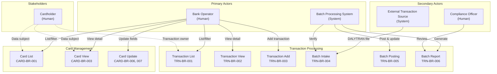

# System Actors and Personas

Formal documentation of all system actors and their interactions with the Transaction Processing and Card Management domains, derived from the extracted COBOL business rules (TRN-BR-001 through TRN-BR-009 and CARD-BR-001 through CARD-BR-011).

## Actor Summary

| Actor | Type | Primary Domain(s) | Key Regulations |
|-------|------|--------------------|-----------------|
| [Bank Operator](#bank-operator) | Primary, Human | Transactions, Card Management | PSD2, GDPR, FFFS 2014:5 |
| [Batch Processing System](#batch-processing-system) | Primary, System | Transactions | PSD2, FFFS 2014:5, AML, DORA |
| [External Transaction Source](#external-transaction-source) | Secondary, System | Transactions | PSD2, FFFS 2014:5 |
| [Compliance Officer](#compliance-officer) | Secondary, Human | Transactions | AML, FFFS 2014:5, DORA |
| [Cardholder](#cardholder) | Stakeholder | Card Management | GDPR, PSD2 |

## Actor Diagram



## Actor Details

### Bank Operator

| Attribute | Value |
|-----------|-------|
| **Type** | Primary, Human |
| **Description** | Internal bank staff operating CICS terminal screens for online transaction and card management operations. In the current mainframe system, authentication is handled by CICS terminal security; the migrated system must enforce equivalent access controls. |
| **Responsibilities** | List, view, and add transactions; list, view, and update credit card records; navigate between transaction and card management screens via menu system. |

#### Use Cases

| Use Case | Business Rules | Description |
|----------|---------------|-------------|
| List transactions with pagination | [TRN-BR-001](../business-rules/transactions/trn-br-001), [TRN-BR-008](../business-rules/transactions/trn-br-008) | Browse the TRANSACT file in paginated pages of 10, filter by Transaction ID, select a transaction for detail view. |
| View transaction detail | [TRN-BR-002](../business-rules/transactions/trn-br-002), [TRN-BR-008](../business-rules/transactions/trn-br-008) | Look up a specific transaction by ID and view all fields (amount, date, description, card number, type, category). |
| Add a new transaction | [TRN-BR-003](../business-rules/transactions/trn-br-003), [TRN-BR-008](../business-rules/transactions/trn-br-008) | Enter a new transaction with validated fields (card number, type code, category, source, description, amount). |
| List cards with filtering | [CARD-BR-001](../business-rules/card-management/card-br-001), [CARD-BR-002](../business-rules/card-management/card-br-002), [CARD-BR-011](../business-rules/card-management/card-br-011) | Browse CARDDAT file in paginated pages of 7, filter by account ID and/or card number. |
| View card detail | [CARD-BR-003](../business-rules/card-management/card-br-003), [CARD-BR-004](../business-rules/card-management/card-br-004), [CARD-BR-005](../business-rules/card-management/card-br-005), [CARD-BR-011](../business-rules/card-management/card-br-011) | Look up a specific card by account number and card number; view all card attributes. |
| Update card record | [CARD-BR-006](../business-rules/card-management/card-br-006), [CARD-BR-007](../business-rules/card-management/card-br-007), [CARD-BR-008](../business-rules/card-management/card-br-008) | Modify card fields (cardholder name, status, expiry) following the confirmation workflow state machine with optimistic concurrency control. |

#### Applicable Regulations

| Regulation | Requirement | Relevance |
|------------|-------------|-----------|
| PSD2 Art. 97 | Strong customer authentication for accessing payment account information | CICS terminal login provides authentication; migrated REST APIs must enforce SCA before granting access to transaction and card data. |
| GDPR Art. 15 | Data subject's right of access | Transaction and card list/view operations serve as the mechanism through which authorized staff fulfil data access requests on behalf of cardholders. |
| FFFS 2014:5 Ch. 7 | Information system requirements for financial institutions | All online operations must maintain an audit trail of operator actions for FSA inspection. |
| FFFS 2014:5 Ch. 8 §4 | Internal controls | Card update workflow (CARD-BR-007) enforces a two-step confirm-before-save control to prevent accidental data changes. |

---

### Batch Processing System

| Attribute | Value |
|-----------|-------|
| **Type** | Primary, System |
| **Description** | Nightly JCL-scheduled batch pipeline consisting of three sequential programs: CBTRN01C (verification), CBTRN02C (posting and balance updates), and CBTRN03C (report generation). Runs within the nightly batch window and must complete by 06:00. |
| **Responsibilities** | Verify daily transaction card references, validate and post transactions to the TRANSACT file, update account and category balances, generate rejected transaction files, produce the daily transaction detail report. |

#### Use Cases

| Use Case | Business Rules | Description |
|----------|---------------|-------------|
| Verify daily transactions | [TRN-BR-004](../business-rules/transactions/trn-br-004), [TRN-BR-009](../business-rules/transactions/trn-br-009) | CBTRN01C reads the DALYTRAN file and verifies each transaction's card number exists in XREFFILE and account exists in ACCTFILE. Advisory only (no rejects written). |
| Post transactions and update balances | [TRN-BR-005](../business-rules/transactions/trn-br-005), [TRN-BR-009](../business-rules/transactions/trn-br-009) | CBTRN02C validates business rules (credit limit, account status, card expiry), posts valid transactions to TRANSACT, updates ACCTFILE balances and TCATBALF category balances, writes rejects to DALYREJS. Returns RC=0 (all valid) or RC=4 (some rejected). |
| Generate daily transaction report | [TRN-BR-006](../business-rules/transactions/trn-br-006), [TRN-BR-009](../business-rules/transactions/trn-br-009) | CBTRN03C reads posted transactions from TRANSACT filtered by date range from DATEPARM, enriches with type/category descriptions, produces formatted TRANREPT grouped by card number with page/account/grand totals. |

#### Pipeline Sequence

```
CBTRN01C (Verify) --> CBTRN02C (Post) --> CBTRN03C (Report)
     |                     |                     |
  DALYTRAN             DALYTRAN              TRANSACT
  XREFFILE             XREFFILE              CARDXREF
  ACCTFILE             ACCTFILE              TRANTYPE
                       TCATBALF              TRANCATG
                       TRANSACT              DATEPARM
                       DALYREJS              TRANREPT
```

#### Applicable Regulations

| Regulation | Requirement | Relevance |
|------------|-------------|-----------|
| PSD2 Art. 64 | End-to-end transaction data integrity | The three-step pipeline ensures verification, validation, posting, and reporting of every transaction. |
| FFFS 2014:5 Ch. 7 | Batch processing controls and audit trail | Return codes, reject files, and reports provide a complete batch audit trail for FSA inspection. |
| AML 2017:11 Para. 3 | Transaction monitoring infrastructure | Daily batch processing is the foundation for nightly AML screening; the reject file and report support suspicious transaction identification. |
| DORA Art. 11 | ICT operational resilience | ABEND handling with error codes supports monitoring, incident response, and SLA tracking for the nightly batch window. |

---

### External Transaction Source

| Attribute | Value |
|-----------|-------|
| **Type** | Secondary, System |
| **Description** | External system that delivers the daily transaction file (DALYTRAN) for batch processing. This is the upstream source of all daily transactions entering the batch pipeline. In the current architecture, the file is a 350-byte sequential record file placed on the mainframe before the nightly batch window opens. |
| **Responsibilities** | Produce and deliver the DALYTRAN file containing the day's transactions in the format defined by copybook CVTRA06Y (350-byte sequential records). Delivery must complete before the batch window opens. |

#### Use Cases

| Use Case | Business Rules | Description |
|----------|---------------|-------------|
| Deliver daily transaction file | [TRN-BR-004](../business-rules/transactions/trn-br-004), [TRN-BR-007](../business-rules/transactions/trn-br-007), [TRN-BR-009](../business-rules/transactions/trn-br-009) | Place the DALYTRAN file in the expected location before the batch window. The file format must conform to the CVTRA06Y copybook layout (350 bytes per record). |

#### Applicable Regulations

| Regulation | Requirement | Relevance |
|------------|-------------|-----------|
| PSD2 Art. 64 | Transaction data integrity | Transactions delivered by the external source must be complete and unaltered; the batch pipeline verifies integrity in step 1 (CBTRN01C). |
| FFFS 2014:5 Ch. 7 | Information system data quality | The external source must deliver records conforming to the defined data structure. Non-conforming records are detected during batch verification. |

---

### Compliance Officer

| Attribute | Value |
|-----------|-------|
| **Type** | Secondary, Human |
| **Description** | Internal compliance staff responsible for reviewing daily transaction reports (TRANREPT), rejected transaction files (DALYREJS), and AML screening results. Does not directly interact with the CICS online system in the current architecture but consumes batch outputs for regulatory oversight. |
| **Responsibilities** | Review the daily transaction detail report for anomalies, investigate rejected transactions for potential compliance issues, ensure AML screening coverage, provide regulatory sign-off on transaction processing. |

#### Use Cases

| Use Case | Business Rules | Description |
|----------|---------------|-------------|
| Review daily transaction report | [TRN-BR-006](../business-rules/transactions/trn-br-006), [TRN-BR-009](../business-rules/transactions/trn-br-009) | Read the TRANREPT output from CBTRN03C, which provides transaction details grouped by card number with page totals, account totals, and grand totals. Used for daily reconciliation and anomaly detection. |
| Review rejected transactions | [TRN-BR-005](../business-rules/transactions/trn-br-005), [TRN-BR-009](../business-rules/transactions/trn-br-009) | Examine the DALYREJS file produced by CBTRN02C to identify transactions that failed validation (invalid card, overlimit, expired account). Investigate patterns that may indicate fraud or compliance issues. |
| AML screening oversight | [TRN-BR-004](../business-rules/transactions/trn-br-004), [TRN-BR-005](../business-rules/transactions/trn-br-005) | Ensure the daily batch processing pipeline provides the data foundation for nightly AML screening. Monitor for suspicious transaction patterns flagged during verification and posting. |

#### Applicable Regulations

| Regulation | Requirement | Relevance |
|------------|-------------|-----------|
| AML 2017:11 | Transaction monitoring and suspicious activity reporting | The compliance officer uses batch outputs (TRANREPT, DALYREJS) to monitor for suspicious transactions and ensure AML screening coverage. |
| FFFS 2014:5 Ch. 7 | Financial reporting and oversight | Daily transaction reports must be available before business hours (06:00 SLA) for compliance review. |
| DORA Art. 11 | ICT risk management and incident reporting | Batch pipeline failures (ABENDs) and high reject rates are incidents that the compliance officer must be aware of for DORA reporting obligations. |

---

### Cardholder

| Attribute | Value |
|-----------|-------|
| **Type** | Stakeholder |
| **Description** | The credit card holder whose personal and financial data is managed through the card management and transaction processing operations. In the current COBOL/CICS system, the cardholder is **not a direct system user** -- all operations are performed by bank operators on the cardholder's behalf. The cardholder's data is the subject of GDPR protections and PSD2 payment rights. |
| **Responsibilities** | None within the system. The cardholder is a data subject whose information is created, read, updated, and reported on by bank operators and batch processes. |

#### Indirect Interactions

| Interaction | Business Rules | Description |
|-------------|---------------|-------------|
| Card data is listed and filtered | [CARD-BR-001](../business-rules/card-management/card-br-001), [CARD-BR-009](../business-rules/card-management/card-br-009), [CARD-BR-010](../business-rules/card-management/card-br-010) | Cardholder name, card number, account associations, and status are displayed when a bank operator browses card records. The card cross-reference (CARD-BR-010) links the cardholder to their account and card. |
| Card data is viewed in detail | [CARD-BR-003](../business-rules/card-management/card-br-003), [CARD-BR-009](../business-rules/card-management/card-br-009) | Full card record including cardholder name (embossed name field) is displayed to the bank operator. |
| Card data is updated | [CARD-BR-006](../business-rules/card-management/card-br-006), [CARD-BR-007](../business-rules/card-management/card-br-007) | Cardholder name, card status, and expiry date can be modified by the bank operator following the confirmation workflow. |
| Transaction data is processed | [TRN-BR-003](../business-rules/transactions/trn-br-003), [TRN-BR-005](../business-rules/transactions/trn-br-005) | Transactions against the cardholder's account are entered by operators and posted by the batch system, affecting the cardholder's balance. |
| Transaction data is reported | [TRN-BR-006](../business-rules/transactions/trn-br-006) | The cardholder's transactions appear in the daily transaction report grouped by card number. |

#### Applicable Regulations

| Regulation | Requirement | Relevance |
|------------|-------------|-----------|
| GDPR Art. 5 | Data minimization and purpose limitation | Card and transaction records must contain only data necessary for the business purpose. The migrated system must not introduce additional PII fields beyond what the COBOL system stores. |
| GDPR Art. 15 | Right of access to personal data | The cardholder has the right to request access to all personal data held by the bank, which bank operators fulfil via card and transaction list/view operations. |
| GDPR Art. 17 | Right to erasure | Upon account closure, cardholder PII must be handled according to data retention policies (subject to regulatory retention periods for financial records). |
| PSD2 Art. 97 | Strong customer authentication | Any system providing cardholder access to their own account information must enforce SCA. In the current system, only bank operators access data on behalf of cardholders. |
| AML/KYC | Customer identification and verification | The card cross-reference (CARD-BR-010) links card numbers to customer IDs, supporting KYC obligations and AML transaction monitoring. |

## Migration Considerations

1. **Authentication model change**: The current system relies on CICS terminal security for bank operator authentication. The migrated REST API system must implement equivalent or stronger authentication (Azure AD for internal users) with role-based access control mapping to the operations currently available in CICS.

2. **Cardholder direct access**: The current COBOL system has no direct cardholder access. If the migrated system introduces customer-facing APIs (e.g., via Online Banking), the cardholder role must be elevated from stakeholder to primary actor with SCA enforcement per PSD2 Art. 97.

3. **Batch to event-driven**: The Batch Processing System actor operates on a nightly schedule. The migrated Azure Functions architecture could support near-real-time processing, which would change the interaction patterns for the External Transaction Source and Compliance Officer actors.

4. **Compliance tooling**: The Compliance Officer currently consumes flat-file batch outputs (TRANREPT, DALYREJS). The migrated system should provide equivalent reporting through Azure SQL queries or dedicated reporting endpoints, maintaining the same information content.

5. **Audit trail**: All actor interactions must be logged for regulatory audit. The migrated system must capture who (operator ID), what (action), when (timestamp), and on which record (entity ID) for every operation, replacing the implicit CICS journal and batch console logging.

---

**Last updated:** 2026-02-15
