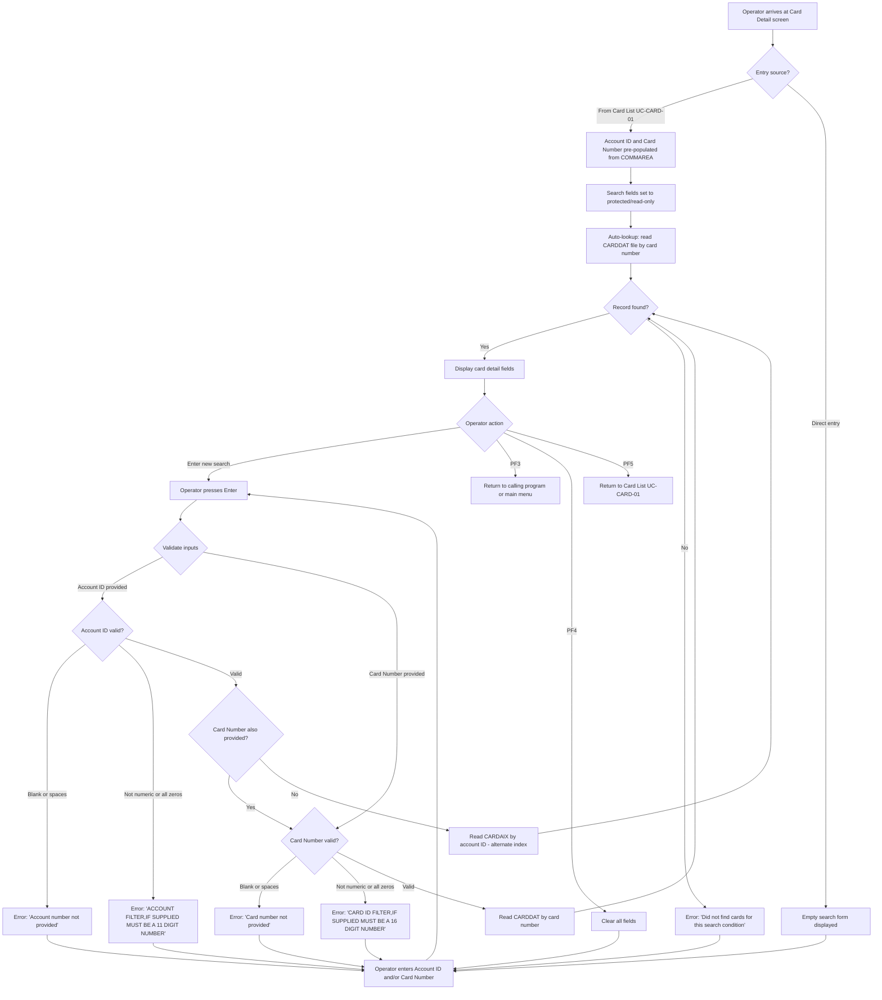

# UC-CARD-02: View Card Detail

## Overview

| Attribute | Value |
|-----------|-------|
| **Use Case ID** | UC-CARD-02 |
| **Title** | View Card Detail |
| **Domain** | Card Management |
| **Primary Actor** | Bank Operator |
| **Trigger** | Operator selects a card from the list with 'S' (UC-CARD-01) or navigates directly |
| **Precondition** | Operator is authenticated; card number or account ID is known |
| **Postcondition** | Card details displayed (card number, account ID, embossed name, expiration date, active status) |
| **Priority** | High |
| **Source Program** | `COCRDSLC.cbl` |
| **CICS Transaction ID** | CC1S |

## Business Rules Traceability

| Business Rule | Title | Source |
|---------------|-------|--------|
| [CARD-BR-003](/docs/business-rules/card-management/card-br-003) | Card detail lookup by account and card number | `COCRDSLC.cbl:608-812` |
| [CARD-BR-004](/docs/business-rules/card-management/card-br-004) | Account number input validation | `COCRDSLC.cbl:647-683` |
| [CARD-BR-005](/docs/business-rules/card-management/card-br-005) | Card number input validation | `COCRDSLC.cbl:685-724` |
| [CARD-BR-009](/docs/business-rules/card-management/card-br-009) | Card record data structure and field definitions | `CVACT02Y.cpy:1-14` |
| [CARD-BR-010](/docs/business-rules/card-management/card-br-010) | Card cross-reference structure | `CVACT03Y.cpy:1-11` |
| [CARD-BR-011](/docs/business-rules/card-management/card-br-011) | Inter-program navigation and COMMAREA data contract | `COCRDLIC.cbl:384-406`, `COCRDSLC.cbl:268-348` |

## Regulatory Traceability

| Regulation | Article/Section | Requirement | How This Use Case Satisfies It |
|------------|----------------|-------------|-------------------------------|
| PSD2 | Art. 97 | Strong customer authentication for accessing payment instrument details | Card detail lookup is a protected operation requiring prior authentication; the migrated system must enforce SCA before displaying card data including embossed name and expiration date |
| GDPR | Art. 15 | Right of access to personal data | The card detail view enables data subjects (via authorized staff) to access their card information; the migrated system must log access for audit trail purposes |
| FFFS 2014:5 | Ch. 4 §3 | Internal controls for data access | Card detail access must be logged and auditable; operators must be authenticated and authorized before viewing card records |

## Main Flow



### Steps

1. **Entry**: The operator arrives at the Card Detail screen either by selecting a card from the Card List (UC-CARD-01) with action 'S' or by navigating directly.
2. **Auto-lookup** (if from list): If the account ID and card number were pre-selected via COMMAREA (`CDEMO-ACCT-ID`, `CDEMO-CARD-NUM`), the search fields are pre-populated and protected (non-editable). The system automatically reads the CARDDAT file and displays the card details.
3. **Manual lookup**: The operator enters an 11-digit account ID and/or a 16-digit card number and presses Enter.
4. **Validation**: The system validates input format:
   - Account ID: must be 11 numeric digits, not blank, not all zeros.
   - Card number: must be 16 numeric digits, not blank, not all zeros.
5. **File read**: The system reads the card record:
   - If card number is provided: reads CARDDAT file using card number as primary key.
   - If only account ID is provided: reads CARDAIX file using account ID as alternate index (returns first matching card).
6. **Display**: If found, the card detail fields are populated on screen. If not found, the error message "Did not find cards for this search condition" is displayed.
7. **Navigation**: The operator can enter new search criteria (Enter), return to the calling program (PF3), clear the screen (PF4), or return to the card list (PF5).

## Card Detail Fields Displayed

| # | Field | COBOL Source Field | Data Type | Format | Description |
|---|-------|--------------------|-----------|--------|-------------|
| 1 | Card Number | `CARD-NUM` | `PIC X(16)` | 16-digit numeric | Primary key, unique card identifier |
| 2 | Account ID | `CARD-ACCT-ID` | `PIC 9(11)` | 11-digit numeric | Foreign key to account master |
| 3 | CVV Code | `CARD-CVV-CD` | `PIC 9(03)` | 3-digit numeric | Card verification value (not displayed to user — PCI DSS) |
| 4 | Embossed Name | `CARD-EMBOSSED-NAME` | `PIC X(50)` | Alphabetics and spaces | Cardholder name as embossed on card |
| 5 | Expiration Date | `CARD-EXPIRAION-DATE` | `PIC X(10)` | `YYYY-MM-DD` | Card expiry date (note: typo in COBOL source field name) |
| 6 | Active Status | `CARD-ACTIVE-STATUS` | `PIC X(01)` | `Y` or `N` | Whether the card is currently active |

**Record structure**: 150 bytes total (CVACT02Y.cpy), including a 59-byte FILLER reserved for future use.

**VSAM files**:
| File | Key | Key Length | Access Method | Purpose |
|------|-----|-----------|---------------|---------|
| CARDDAT | CARD-NUM | 16 bytes | Primary key (KSDS) | Direct card lookup by card number |
| CARDAIX | CARD-ACCT-ID | 11 bytes | Alternate index (AIX) | Card lookup by account ID |

## User Stories

### US-CARD-02.1: Auto-lookup from card list selection

> As a bank operator, I want the card details to load automatically when I select a card from the list with 'S', so that search fields are pre-populated and protected (read-only).

**Acceptance Criteria:**

```gherkin
Scenario: Auto-lookup from card list selection
  Given the user selected a card from the card list (COCRDLIC) with action 'S'
    And the selected card has account "12345678901" and card number "4000123456789012"
  When the card detail screen loads
  Then the account ID field shows "12345678901" and is protected (non-editable)
    And the card number field shows "4000123456789012" and is protected (non-editable)
    And the card details are automatically retrieved and displayed
```

**Business Rule:** [CARD-BR-003](/docs/business-rules/card-management/card-br-003) Scenario 4, [CARD-BR-011](/docs/business-rules/card-management/card-br-011) Scenario 1

**COBOL Source:** `COCRDSLC.cbl:339-348` — Entry from card list with pre-validated keys; `COCRDSLC.cbl:505-512` — Field protection when coming from list.

---

### US-CARD-02.2: Manual lookup by card number

> As a bank operator, I want to enter a 16-digit card number to look up card details, so that I can find any card directly.

**Acceptance Criteria:**

```gherkin
Scenario: Manual lookup by card number
  Given the card detail screen is displayed with editable search fields
    And a card with number "4000123456789012" exists in the system
  When the user enters card number "4000123456789012" and presses Enter
  Then the matching card record is read from the CARDDAT file
    And the card detail fields are populated:
      | Field           | Value              |
      | Card Number     | 4000123456789012   |
      | Account ID      | 12345678901        |
      | Embossed Name   | JOHN DOE           |
      | Expiration Date | 2027-12-31         |
      | Active Status   | Y                  |
```

**Business Rule:** [CARD-BR-003](/docs/business-rules/card-management/card-br-003) Scenario 1

**COBOL Source:** `COCRDSLC.cbl:736-774` — `9100-GETCARD-BYACCTCARD` reads CARDDAT by card number as primary key.

---

### US-CARD-02.3: Manual lookup by account ID

> As a bank operator, I want to enter an 11-digit account ID to look up the first card for that account (via alternate index CARDAIX), so that I can find cards when I only know the account.

**Acceptance Criteria:**

```gherkin
Scenario: Lookup by account ID via alternate index
  Given the card detail screen is displayed with editable search fields
    And an account "12345678901" has at least one card in the system
  When the user enters account ID "12345678901" without a card number and presses Enter
  Then the first card associated with that account is read from the CARDAIX alternate index
    And the card detail fields are populated with the first matching card's data
```

**Business Rule:** [CARD-BR-003](/docs/business-rules/card-management/card-br-003) Scenario 2

**COBOL Source:** `COCRDSLC.cbl:779-813` — `9150-GETCARD-BYACCT` reads CARDAIX by account ID as alternate index key.

---

### US-CARD-02.4: View card detail fields

> As a bank operator, I want to see card number, account ID, embossed name, expiration date (YYYY-MM-DD), and active status, so that I have complete card information.

**Acceptance Criteria:**

```gherkin
Scenario: All card detail fields displayed
  Given a card record exists in the CARDDAT file
  When the card is looked up (manually or from list)
  Then the following fields are displayed:
    | Field           | Format        |
    | Card Number     | X(16)         |
    | Account ID      | 9(11)         |
    | Embossed Name   | X(50)         |
    | Expiration Date | YYYY-MM-DD    |
    | Active Status   | Y or N        |

Scenario: Expiration date format preservation
  Given a card record with expiration date "2028-06-15"
  When the card is displayed
  Then the expiration date shows "2028-06-15" in YYYY-MM-DD format
```

**Business Rule:** [CARD-BR-009](/docs/business-rules/card-management/card-br-009) Scenarios 1, 2

**COBOL Source:** `CVACT02Y.cpy:1-14` — Card record structure defining all fields and their formats.

---

### US-CARD-02.5: Handle card not found

> As a bank operator, I want to see "Did not find cards for this search condition" when the lookup fails, so that I know the card doesn't exist.

**Acceptance Criteria:**

```gherkin
Scenario: Card not found by card number
  Given no card with number "9999999999999999" exists in the system
  When the user enters card number "9999999999999999" and presses Enter
  Then the message "Did not find cards for this search condition" is displayed
    And no detail fields are populated

Scenario: Card not found by account ID
  Given no cards exist for account "99999999999"
  When the user enters account ID "99999999999" and presses Enter
  Then the message "Did not find cards for this search condition" is displayed
    And no detail fields are populated
```

**Business Rule:** [CARD-BR-003](/docs/business-rules/card-management/card-br-003) Scenario 3

**COBOL Source:** `COCRDSLC.cbl:745-748` — NOTFND response handling for CARDDAT; `COCRDSLC.cbl:788-791` — NOTFND response handling for CARDAIX.

---

### US-CARD-02.6: Validate input format

> As a bank operator, I want the system to validate that account IDs are 11 numeric digits and card numbers are 16 numeric digits (not blank, not all zeros), so that malformed input is rejected early.

**Acceptance Criteria:**

```gherkin
Scenario: Invalid account number - not numeric
  Given the user enters "ABC12345678" as the account number
  When the input is validated
  Then the error message "ACCOUNT FILTER,IF SUPPLIED MUST BE A 11 DIGIT NUMBER" is displayed
    And no data lookup is performed

Scenario: Invalid account number - all zeros
  Given the user enters "00000000000" as the account number
  When the input is validated
  Then the error message "ACCOUNT FILTER,IF SUPPLIED MUST BE A 11 DIGIT NUMBER" is displayed
    And no data lookup is performed

Scenario: Account number is blank
  Given the account number field is empty
    And no card number is provided
  When the input is validated
  Then the error message "Account number not provided" is displayed

Scenario: Invalid card number - not numeric
  Given the user enters "12345" as the card number
  When the input is validated
  Then the error message "CARD ID FILTER,IF SUPPLIED MUST BE A 16 DIGIT NUMBER" is displayed
    And no data lookup is performed

Scenario: Invalid card number - all zeros
  Given the user enters "0000000000000000" as the card number
  When the input is validated
  Then the error message "CARD ID FILTER,IF SUPPLIED MUST BE A 16 DIGIT NUMBER" is displayed
    And no data lookup is performed

Scenario: Card number is blank
  Given the card number field is empty
    And an account ID is not provided
  When the input is validated
  Then the error message "Card number not provided" is displayed
```

**Business Rule:** [CARD-BR-004](/docs/business-rules/card-management/card-br-004), [CARD-BR-005](/docs/business-rules/card-management/card-br-005)

**COBOL Source:** `COCRDSLC.cbl:647-672` — Account ID validation (blank, non-numeric, all zeros); `COCRDSLC.cbl:685-725` — Card number validation (blank, non-numeric, all zeros).

## Decision Table

| Entry Source | Account ID | Card Number | Lookup Method | Outcome |
|-------------|-----------|-------------|---------------|---------|
| From Card List (COCRDLIC) | Pre-populated (protected) | Pre-populated (protected) | Primary key on CARDDAT | Card detail displayed, search fields protected |
| Direct entry | Valid | Valid | Primary key on CARDDAT | Card detail displayed |
| Direct entry | Valid | Not provided | Alternate index CARDAIX | First matching card displayed |
| Direct entry | Not provided | Valid | Primary key on CARDDAT | Card detail displayed |
| Direct entry | Not provided | Not provided | N/A | Error: "Account number not provided" / "Card number not provided" |
| Any | Invalid (non-numeric / zeros) | N/A | N/A | Error: validation message |
| Any | N/A | Invalid (non-numeric / zeros) | N/A | Error: validation message |
| Any | Valid | Valid (not found) | Primary key, NOTFND | Error: "Did not find cards for this search condition" |
| Any | Valid (not found) | Not provided | Alternate index, NOTFND | Error: "Did not find cards for this search condition" |
| Any | N/A | N/A | PF3 | Return to calling program or main menu |
| Any | N/A | N/A | PF4 | Clear all screen fields |
| Any | N/A | N/A | PF5 | Return to Card List (COCRDLIC) |
| Any | N/A | N/A | Other key | Error: "Invalid key pressed" |

## Navigation Context

This use case participates in the card management navigation flow defined in [CARD-BR-011](/docs/business-rules/card-management/card-br-011):

```
Main Menu (COMEN01C)
       |
  Enter|
       v
Card List (COCRDLIC / UC-CARD-01)
       |
  'S' selection    PF5 (return)
       |<--------------+
       v               |
Card Detail (COCRDSLC / UC-CARD-02) <-- This use case
       |
  PF3  |
       v
Return to calling program (COCRDLIC) or main menu (COMEN01C)
```

The COMMAREA data contract carries context between programs:
- `CDEMO-FROM-PROGRAM`: Identifies the calling program (e.g., `COCRDLIC`)
- `CDEMO-ACCT-ID`: Selected account ID (11 digits)
- `CDEMO-CARD-NUM`: Selected card number (16 digits)
- `CDEMO-PGM-ENTER` / `CDEMO-PGM-REENTER`: Controls first-entry vs. re-entry behavior

When arriving from the Card List, `CDEMO-FROM-PROGRAM = "COCRDLIC"` triggers pre-population of search fields and sets them to protected (non-editable).

## Edge Cases and Migration Notes

1. **Alternate index returns only the first card**: When looking up by account ID using CARDAIX, the CICS READ returns only the first matching record by primary key order. If an account has multiple cards, only one is displayed. The migrated system should clarify whether single-card or multi-card display is expected for account-based lookups — a disambiguation list may be more appropriate.

2. **Card number masking**: The full 16-digit card number is displayed unmasked in the COBOL system. Under PSD2 and GDPR, the migrated system should mask the card number (show only last 4 digits) unless the operator has explicit authorization to view full card numbers.

3. **CVV display**: The CVV code (`CARD-CVV-CD`) is part of the card record structure but should never be displayed to operators. PCI DSS prohibits displaying or storing CVV after authorization. The migrated system must suppress this field from the detail view entirely.

4. **Expiration date typo**: The COBOL source field is named `CARD-EXPIRAION-DATE` (missing 'T' in "EXPIRATION"). The migrated system should use the correct spelling `CardExpirationDate` while maintaining the data mapping to the original field.

5. **COMMAREA data integrity**: When arriving from COCRDLIC, the account and card number are passed via COMMAREA. If the COMMAREA is corrupted or truncated, the pre-populated fields may contain invalid data. The COBOL code does not explicitly validate COMMAREA contents from the calling program. The migrated system should validate input parameters regardless of source.

6. **Concurrent card deletion**: If a card is deleted by another user between the list display and the detail lookup, the READ returns NOTFND. The COBOL program handles this with the "Did not find cards" message. The migrated system must handle this race condition identically.

7. **EBCDIC to Unicode conversion**: PIC 9 fields (CARD-ACCT-ID, CARD-CVV-CD) are stored in EBCDIC zoned decimal format. During migration, these must be converted to their numeric string equivalents. PIC X fields require EBCDIC-to-UTF-8 conversion.

8. **Expiration date as string**: The expiry date is stored as a formatted string `YYYY-MM-DD` rather than as separate numeric components. The migrated system should use `DateOnly` in .NET while maintaining the formatted representation for display compatibility.

## Domain Expert Review

**Status:** Awaiting domain expert review.

**Key questions for validation:**
- Should the card number be masked in the migrated system? Current COBOL displays it in full.
- When looking up by account ID (alternate index), should the system show only the first card or present a disambiguation list for multi-card accounts?
- Is CVV storage still appropriate given PCI DSS requirements, or should CVV be removed from the migrated data model entirely?
- Should the view screen support editing card fields directly in the future, or should update always go through the separate update flow (UC-CARD-03)?

---

**Template version:** 1.0
**Last updated:** 2026-02-15
