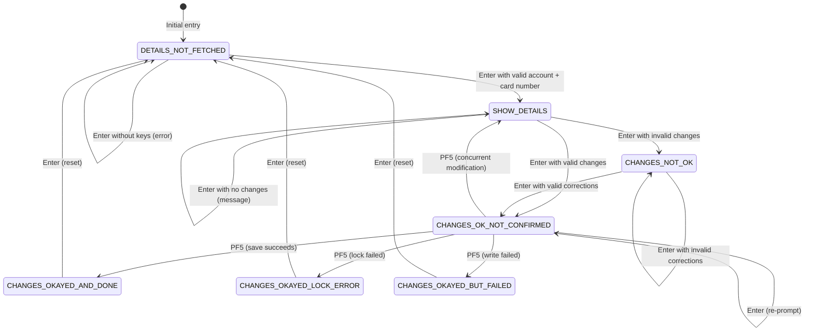

# UC-CARD-03: Update Card

## Overview

| Attribute | Value |
|---|---|
| **Use Case ID** | UC-CARD-03 |
| **Title** | Update Card |
| **Primary Actor** | [Bank Operator](/docs/requirements/actors-and-personas#bank-operator) |
| **Source Program** | `COCRDUPC.cbl` (lines 275–1523) |
| **Business Rules** | [CARD-BR-004](/docs/business-rules/card-management/card-br-004), [CARD-BR-005](/docs/business-rules/card-management/card-br-005), [CARD-BR-006](/docs/business-rules/card-management/card-br-006), [CARD-BR-007](/docs/business-rules/card-management/card-br-007), [CARD-BR-008](/docs/business-rules/card-management/card-br-008), [CARD-BR-009](/docs/business-rules/card-management/card-br-009), [CARD-BR-011](/docs/business-rules/card-management/card-br-011) |
| **Trigger** | Operator selects a card from the list with 'U' (UC-CARD-01) or navigates directly to the update screen |
| **Preconditions** | Operator is authenticated; card exists in CARDDAT file |
| **Postcondition** | Card record updated with validated changes, confirmed by operator |
| **Priority** | High |

## Summary

The Update Card use case is the most complex online operation in the card management domain. It allows an authenticated bank operator to modify four editable fields on a card record: embossed name, active status, expiry month, and expiry year. The workflow is governed by a 7-state state machine (CARD-BR-007) that enforces a multi-step confirmation process: view details, edit fields, validate changes, and explicitly confirm before saving. The system implements optimistic concurrency control (CARD-BR-008) to prevent lost updates when multiple operators modify the same card simultaneously.

This use case is extracted from `COCRDUPC.cbl` and formalizes business rules CARD-BR-004 through CARD-BR-009 and CARD-BR-011.

## User Stories

### US-CARD-03.1: Fetch card details for editing

> As a **bank operator**, I want the card details to load automatically when I select a card from the list with 'U', so that I can begin editing immediately with search fields protected.

**Acceptance criteria:**

```gherkin
Scenario: Card details loaded from list selection
  Given the operator is on the card list screen (UC-CARD-01)
  And the operator enters 'U' next to card "4000123456789012" on account "12345678901"
  When the system transfers control to the card update screen
  Then the card data is fetched from the CARDDAT file
  And the account number and card number fields are protected (read-only)
  And the embossed name, active status, expiry month, and expiry year fields are editable
  And the state is set to SHOW-DETAILS

Scenario: Direct navigation prompts for search criteria
  Given the operator navigates to the card update screen from the main menu
  And no card data has been pre-selected
  When the screen is displayed
  Then the account number and card number fields are editable
  And the card detail fields are protected (empty)
  And the message "Please enter Account and Card Number" is displayed
  And the state is DETAILS-NOT-FETCHED
```

**Source:** `COCRDUPC.cbl:482-494` — Entry from card list with pre-validated keys. `COCRDUPC.cbl:429-470` — Fresh entry handling.

### US-CARD-03.2: Edit embossed name

> As a **bank operator**, I want to change the cardholder's embossed name (alphabetics and spaces only, max 50 chars), so that the card reflects the correct name.

**Acceptance criteria:**

```gherkin
Scenario: Valid embossed name accepted
  Given the card update screen shows card details
  And the operator changes the embossed name to "JANE DOE"
  When the input is validated
  Then the embossed name validation passes
  And the system proceeds to the confirmation step

Scenario: Embossed name with numbers rejected
  Given the card update screen shows card details
  And the operator changes the embossed name to "JOHN DOE 3RD"
  When the input is validated
  Then the error message "Card name can only contain alphabets and spaces" is displayed
  And the card name field is highlighted

Scenario: Blank embossed name rejected
  Given the card update screen shows card details
  And the operator clears the embossed name field
  When the input is validated
  Then the error message "Card name not provided" is displayed
```

**Source:** `COCRDUPC.cbl:806-843` — 1230-EDIT-NAME paragraph. Validation converts all A-Z/a-z to spaces and checks if any non-space characters remain.

### US-CARD-03.3: Edit active status

> As a **bank operator**, I want to change the card's active status to 'Y' (active) or 'N' (inactive), so that I can activate or deactivate a card.

**Acceptance criteria:**

```gherkin
Scenario: Valid active status 'Y' accepted
  Given the card update screen shows card details with status 'N'
  And the operator changes the active status to "Y"
  When the input is validated
  Then the status validation passes

Scenario: Invalid active status rejected
  Given the card update screen shows card details
  And the operator enters "A" as the active status
  When the input is validated
  Then the error message "Card Active Status must be Y or N" is displayed

Scenario: Blank active status rejected
  Given the card update screen shows card details
  And the operator clears the active status field
  When the input is validated
  Then the error message "Card Active Status must be Y or N" is displayed
```

**Source:** `COCRDUPC.cbl:845-876` — 1240-EDIT-CARDSTATUS paragraph. Uses 88-level condition FLG-YES-NO-VALID accepting only 'Y' and 'N'.

### US-CARD-03.4: Edit expiry month and year

> As a **bank operator**, I want to change the expiry month (1–12) and year (1950–2099), so that the card's validity period can be updated. The expiry day is NOT editable and is carried from the original record.

**Acceptance criteria:**

```gherkin
Scenario: Valid expiry month accepted
  Given the card update screen shows card details
  And the operator changes the expiry month to "06"
  When the input is validated
  Then the expiry month validation passes

Scenario: Expiry month 13 rejected
  Given the card update screen shows card details
  And the operator changes the expiry month to "13"
  When the input is validated
  Then the error message "Card expiry month must be between 1 and 12" is displayed

Scenario: Expiry month zero rejected
  Given the card update screen shows card details
  And the operator changes the expiry month to "00"
  When the input is validated
  Then the error message "Card expiry month must be between 1 and 12" is displayed

Scenario: Valid expiry year accepted
  Given the card update screen shows card details
  And the operator changes the expiry year to "2028"
  When the input is validated
  Then the expiry year validation passes

Scenario: Expiry year outside range rejected
  Given the card update screen shows card details
  And the operator changes the expiry year to "2100"
  When the input is validated
  Then the error message "Invalid card expiry year" is displayed

Scenario: Expiry year below range rejected
  Given the card update screen shows card details
  And the operator changes the expiry year to "1949"
  When the input is validated
  Then the error message "Invalid card expiry year" is displayed
```

**Source:** `COCRDUPC.cbl:877-912` — 1250-EDIT-EXPIRY-MON. `COCRDUPC.cbl:913-947` — 1260-EDIT-EXPIRY-YEAR. Month uses 88-level VALID-MONTH (1 THRU 12); year uses 88-level VALID-YEAR (1950 THRU 2099).

### US-CARD-03.5: Validate all changed fields

> As a **bank operator**, I want the system to validate changed fields (name: alpha+spaces only; status: Y/N; month: 1–12; year: 1950–2099) before allowing confirmation, so that invalid data is rejected.

**Acceptance criteria:**

```gherkin
Scenario: All fields validated sequentially
  Given the operator has modified the embossed name, status, and expiry fields
  When the operator presses Enter
  Then the system validates name, then status, then month, then year
  And validation stops at the first error encountered
  And the error message for the first invalid field is displayed
  And the cursor is positioned at the first invalid field

Scenario: All fields valid triggers confirmation prompt
  Given the operator has modified one or more fields with valid values
  When the operator presses Enter
  Then all validations pass
  And the state transitions to CHANGES-OK-NOT-CONFIRMED
  And the message prompts the operator to press PF5 to confirm
```

**Source:** `COCRDUPC.cbl:806-947` — Sequential validation of all four editable fields in paragraphs 1230, 1240, 1250, 1260. The WS-RETURN-MSG-OFF flag ensures only the first error message is shown.

### US-CARD-03.6: Detect no-change submissions

> As a **bank operator**, I want the system to detect when no fields have actually changed (case-insensitive comparison) and inform me, so that unnecessary updates are avoided.

**Acceptance criteria:**

```gherkin
Scenario: No changes detected
  Given the card update screen shows card details
  And the operator submits without making any changes
  When the input is validated
  Then the message "No change detected with respect to values fetched." is displayed
  And no update operation is performed
  And the state remains SHOW-DETAILS

Scenario: Case-insensitive change detection
  Given the card has embossed name "JOHN DOE" stored in the database
  And the operator changes the embossed name to "John Doe"
  When the input is validated
  Then no change is detected (comparison uses UPPER-CASE function)
  And the message "No change detected with respect to values fetched." is displayed
```

**Source:** `COCRDUPC.cbl:806-810` — Change detection compares new card data with old card data using case-insensitive comparison before performing field-level validation.

### US-CARD-03.7: Confirm before saving (PF5)

> As a **bank operator**, I want to explicitly press PF5 to confirm my changes after validation passes, so that accidental modifications are prevented.

**Acceptance criteria:**

```gherkin
Scenario: PF5 confirms and saves successfully
  Given the changes have been validated
  And the state is CHANGES-OK-NOT-CONFIRMED
  When the operator presses PF5
  Then the system acquires an update lock on the card record
  And the system verifies no concurrent modifications occurred
  And the new values are written to the CARDDAT file
  And the message "Changes committed to database" is displayed
  And the state transitions to CHANGES-OKAYED-AND-DONE

Scenario: PF5 ignored in wrong state
  Given the state is SHOW-DETAILS (not yet validated)
  When the operator presses PF5
  Then PF5 is treated as an invalid key
  And the message "Invalid key pressed" is displayed
  And no save operation is performed

Scenario: Enter pressed instead of PF5 after validation
  Given the state is CHANGES-OK-NOT-CONFIRMED
  When the operator presses Enter (instead of PF5)
  Then the state remains CHANGES-OK-NOT-CONFIRMED
  And the confirmation prompt is re-displayed
```

**Source:** `COCRDUPC.cbl:413-420` — PF5 is only valid when state is CHANGES-OK-NOT-CONFIRMED. `COCRDUPC.cbl:988-1001` — 2000-DECIDE-ACTION performs write processing on PF5.

### US-CARD-03.8: Handle concurrent modification

> As a **bank operator**, I want the system to detect if another user modified the card since I loaded it, show me the refreshed data, and let me re-review, so that I never overwrite someone else's changes unknowingly.

**Acceptance criteria:**

```gherkin
Scenario: Concurrent modification detected
  Given operator A has loaded card "4000123456789012" with name "JOHN DOE"
  And operator B has subsequently changed the name to "JANE DOE" and saved
  When operator A presses PF5 to confirm their changes
  Then the system acquires an update lock
  And the system detects that CARD-EMBOSSED-NAME has changed
  And the message "Record changed by some one else. Please review" is displayed
  And the screen shows the updated data (name "JANE DOE")
  And operator A can now review the changes and decide whether to resubmit

Scenario: No concurrent modification — update proceeds
  Given a user has validated changes to card "4000123456789012"
  And no other user has modified the card since it was loaded
  When the user presses PF5 to confirm
  Then the current record values match the originally loaded values
  And the new values are written to the CARDDAT file
  And the message "Changes committed to database" is displayed
```

**Optimistic concurrency fields compared:**

| Field | Description |
|---|---|
| CARD-CVV-CD | CVV code (not user-editable, but compared for external changes) |
| CARD-EMBOSSED-NAME | Cardholder name (uppercase comparison) |
| CARD-EXPIRAION-DATE(1:4) | Expiry year |
| CARD-EXPIRAION-DATE(6:2) | Expiry month |
| CARD-EXPIRAION-DATE(9:2) | Expiry day |
| CARD-ACTIVE-STATUS | Active/inactive flag |

**Source:** `COCRDUPC.cbl:1498-1523` — 9300-CHECK-CHANGE-IN-REC compares all six fields after converting embossed name to uppercase for case-insensitive comparison.

### US-CARD-03.9: Handle lock failure

> As a **bank operator**, I want to see a clear error if the record cannot be locked for update, so that I know to retry later.

**Acceptance criteria:**

```gherkin
Scenario: Record lock failure
  Given the operator has validated changes to a card
  And another transaction currently holds an update lock on the same record
  When the operator presses PF5 to confirm
  Then the CICS READ UPDATE returns a non-NORMAL response
  And the message "Could not lock record for update" is displayed
  And no data is modified
  And the state transitions to CHANGES-OKAYED-LOCK-ERROR

Scenario: Write failure after successful lock
  Given the operator's changes have been validated and the record lock was acquired
  And the record has not been modified by another user
  When the REWRITE operation fails (non-NORMAL response)
  Then the message "Update of record failed" is displayed
  And the state transitions to CHANGES-OKAYED-BUT-FAILED
```

**Source:** `COCRDUPC.cbl:1427-1449` — Lock acquisition via CICS READ UPDATE. `COCRDUPC.cbl:1477-1483` — REWRITE with RESP check. `COCRDUPC.cbl:992-996` — State transitions for lock error and write failure.

### US-CARD-03.10: Cancel changes (PF12)

> As a **bank operator**, I want to press PF12 to discard my changes and reload the original data, so that I can start over.

**Acceptance criteria:**

```gherkin
Scenario: PF12 cancels and reloads from list context
  Given the operator is on the card update screen with modified card data
  And the operator arrived from the card list (CDEMO-FROM-PROGRAM = "COCRDLIC")
  When the operator presses PF12
  Then the original card data is re-read from the database
  And all user modifications are discarded
  And the screen displays the original values
  And the state is reset to SHOW-DETAILS

Scenario: PF12 ignored in initial state
  Given the state is DETAILS-NOT-FETCHED
  When the operator presses PF12
  Then PF12 is treated as an invalid key
  And no action is performed
```

**Source:** `COCRDUPC.cbl:418` — PF12 is only valid when NOT in DETAILS-NOT-FETCHED state. `COCRDUPC.cbl:484-494` — PF12 from list context re-reads card data.

## State Machine

The card update workflow is governed by a 7-state state machine defined in `COCRDUPC.cbl:275-290`:



**State variable:** `CCUP-CHANGE-ACTION` (PIC X(1))

| State | Code | Description |
|---|---|---|
| DETAILS-NOT-FETCHED | LOW-VALUES / SPACES | Initial state; no card data loaded |
| SHOW-DETAILS | 'S' | Card data displayed; fields editable |
| CHANGES-NOT-OK | 'E' | Validation errors detected |
| CHANGES-OK-NOT-CONFIRMED | 'N' | All validations passed; awaiting PF5 confirmation |
| CHANGES-OKAYED-AND-DONE | 'C' | Successfully saved |
| CHANGES-OKAYED-LOCK-ERROR | 'L' | Lock acquisition failed |
| CHANGES-OKAYED-BUT-FAILED | 'F' | Write operation failed |

**Source:** `COCRDUPC.cbl:275-290` (state definitions), `COCRDUPC.cbl:429-543` (main EVALUATE), `COCRDUPC.cbl:948-1027` (action decisions).

## Main Flow

```
1. Operator selects 'U' on a card in the card list screen (UC-CARD-01)
   OR navigates directly to the card update screen from the main menu
2. System checks authentication (COMMAREA/EIBCALEN)
   - If not authenticated → redirect to sign-on screen
3. IF arriving from card list:
   a. Card data is fetched automatically using passed account/card number
   b. Account and card number fields are protected (read-only)
   c. State → SHOW-DETAILS
   IF arriving directly:
   a. Empty form displayed with editable search fields
   b. State → DETAILS-NOT-FETCHED
   c. Operator enters account number and card number
   d. System validates both keys (CARD-BR-004, CARD-BR-005)
   e. Card data fetched from CARDDAT file
   f. State → SHOW-DETAILS
4. Operator modifies one or more editable fields:
   - Embossed name (alphabetics and spaces, max 50 chars)
   - Active status ('Y' or 'N')
   - Expiry month (1–12)
   - Expiry year (1950–2099)
   Note: Expiry day is NOT editable
5. Operator presses Enter
6. System compares new values to original values (case-insensitive)
   - If no changes detected → display message, remain in SHOW-DETAILS
7. System validates each changed field (CARD-BR-006):
   - Name → 1230-EDIT-NAME
   - Status → 1240-EDIT-CARDSTATUS
   - Month → 1250-EDIT-EXPIRY-MON
   - Year → 1260-EDIT-EXPIRY-YEAR
   - On validation failure → display first error, state → CHANGES-NOT-OK
8. All validations pass → state → CHANGES-OK-NOT-CONFIRMED
   - Message: "Changes validated. Press F5 to save"
   - All fields become protected (read-only)
9. Operator presses PF5 to confirm
10. System acquires update lock on card record (CICS READ UPDATE)
    - If lock fails → "Could not lock record for update", state → LOCK-ERROR
11. System compares 6 fields against original values (CARD-BR-008):
    CVV, embossed name, expiry year, expiry month, expiry day, active status
    - If any field changed → "Record changed by some one else. Please review"
    - Screen refreshed with current data, state → SHOW-DETAILS
12. System writes updated record (CICS REWRITE)
    - If write fails → "Update of record failed", state → FAILED
13. Success: "Changes committed to database", state → CHANGES-OKAYED-AND-DONE
14. Operator presses Enter → state resets to DETAILS-NOT-FETCHED for next operation
```

## Alternative Flows

| ID | Trigger | Flow |
|---|---|---|
| **AF-1** | PF3 pressed | SYNCPOINT issued; return to calling program (card list) or main menu if no caller context |
| **AF-2** | PF12 pressed (from list context) | Re-read original card data from database; discard all changes; state → SHOW-DETAILS |
| **AF-3** | PF12 pressed (DETAILS-NOT-FETCHED) | Treated as invalid key; no action |
| **AF-4** | Invalid key pressed | Display "Invalid key pressed" message; PF5 is only valid in CHANGES-OK-NOT-CONFIRMED state |
| **AF-5** | Account not found | Display "Account number not provided" or account validation error (CARD-BR-004) |
| **AF-6** | Card not found | Display "Card number not provided" or card validation error (CARD-BR-005) |
| **AF-7** | Concurrent modification | Update aborted; screen refreshed with current data; operator must re-review |
| **AF-8** | Lock failure | Display "Could not lock record for update"; no data modified |
| **AF-9** | Write failure | Display "Update of record failed"; state → CHANGES-OKAYED-BUT-FAILED |

## Validation Rules

| Field | Validation | Error Message | Source |
|---|---|---|---|
| Account ID | Must be 11 digits, numeric, not blank, not all zeros | "Account number not provided" / "ACCOUNT FILTER,IF SUPPLIED MUST BE A 11 DIGIT NUMBER" | CARD-BR-004 |
| Card Number | Must be 16 digits, numeric, not blank, not all zeros | "Card number not provided" / "CARD ID FILTER,IF SUPPLIED MUST BE A 16 DIGIT NUMBER" | CARD-BR-005 |
| Embossed Name | Alphabetics (A-Z, a-z) and spaces only; max 50 chars; cannot be blank | "Card name not provided" / "Card name can only contain alphabets and spaces" | CARD-BR-006 |
| Active Status | Must be 'Y' or 'N'; cannot be blank | "Card Active Status must be Y or N" | CARD-BR-006 |
| Expiry Month | Numeric, 1–12; cannot be blank or zero | "Card expiry month must be between 1 and 12" | CARD-BR-006 |
| Expiry Year | Numeric, 1950–2099; cannot be blank or zero | "Invalid card expiry year" | CARD-BR-006 |
| Expiry Day | Not user-editable; carried from original record | N/A | CARD-BR-006 |

## PF Key Mapping

| PF Key | Valid States | Action |
|---|---|---|
| Enter | All | Process input based on current state |
| PF3 | All | Exit to calling program or main menu (SYNCPOINT issued) |
| PF5 | CHANGES-OK-NOT-CONFIRMED only | Confirm and save changes |
| PF12 | All except DETAILS-NOT-FETCHED | Cancel changes, reload original data |

**Source:** `COCRDUPC.cbl:413-420` — PF key validity check.

## Data Structure

The card record layout is defined in copybook `CVACT02Y.cpy` (CARD-BR-009):

| Field | Type | Length | Format | Editable in Update |
|---|---|---|---|---|
| CARD-NUM | PIC X(16) | 16 | Numeric digits | No (search key) |
| CARD-ACCT-ID | PIC 9(11) | 11 | Zoned decimal | No (search key) |
| CARD-CVV-CD | PIC 9(03) | 3 | Zoned decimal | No (system-managed) |
| CARD-EMBOSSED-NAME | PIC X(50) | 50 | Alphabetics + spaces | **Yes** |
| CARD-EXPIRAION-DATE | PIC X(10) | 10 | YYYY-MM-DD | **Partially** (month + year only; day carried) |
| CARD-ACTIVE-STATUS | PIC X(01) | 1 | 'Y' or 'N' | **Yes** |
| FILLER | PIC X(59) | 59 | Reserved | No |

**Total record length:** 150 bytes.

## Regulatory Traceability

| Regulation | Article/Section | Requirement | How This Use Case Satisfies It |
|---|---|---|---|
| PSD2 | Art. 97 | Strong customer authentication for payment instrument modifications | Multi-step confirmation workflow (view → edit → validate → confirm via PF5) ensures intentional modification of payment card data; optimistic concurrency control prevents unauthorized overwrites |
| FFFS 2014:5 | Ch. 4 §3 | Adequate systems for managing operational risk | Field-level validation (CARD-BR-006) prevents corrupted or malformed data from being persisted to the card master file |
| FFFS 2014:5 | Ch. 8 §4 | Operational risk management in concurrent access | State machine prevents partial or accidental updates; optimistic concurrency control (CARD-BR-008) ensures data integrity when multiple operators access the same record |
| GDPR | Art. 5(1)(d) | Personal data must be accurate and kept up to date | Embossed name validation and expiry date validation ensure cardholder personal data updates meet format requirements; no-change detection prevents unnecessary data modifications |

## Migration Notes

1. **State machine pattern**: The COBOL 88-level state variable (`CCUP-CHANGE-ACTION`) should be implemented as a State design pattern or a finite state machine in .NET. This provides explicit state transitions and makes the workflow testable. Consider using a library such as Stateless for .NET.

2. **Optimistic concurrency**: Replace the COBOL field-by-field comparison (CARD-BR-008) with a database-native mechanism. Options include:
   - `rowversion`/`timestamp` column in Azure SQL (recommended)
   - ETag-based HTTP concurrency for the REST API layer
   - The migrated system should still compare all six fields during the transition period for parallel-run validation.

3. **Embossed name character set**: The COBOL validation only accepts A-Z/a-z (52 ASCII alphabetic characters). Swedish characters (Å, Ä, Ö, å, ä, ö) are rejected. The migrated system **must** support Unicode characters appropriate for Swedish names. This requires domain expert confirmation before implementation.

4. **Active status case sensitivity**: The COBOL 88-level condition accepts only uppercase 'Y' and 'N'. The migrated system should decide whether to accept lowercase input with automatic conversion to uppercase. Domain expert review required.

5. **Expiry year range**: The COBOL range 1950–2099 may need updating for the migrated system. Additionally, the COBOL code does not validate whether the expiry date is in the future — a user could set an expiry date of "01/1950". The migrated system should consider adding a future-date check, subject to domain expert approval.

6. **Expiry day not editable**: The COBOL program explicitly does NOT allow users to change the expiry day field (`COCRDUPC.cbl:1122-1123`). The day is always carried from the original record. The migrated system must preserve this behavior.

7. **First-error-only reporting**: The COBOL code reports only the first validation error (via `WS-RETURN-MSG-OFF` flag). The migrated system should present all validation errors simultaneously for better UX.

8. **PF-key mapping**: Map CICS PF-key actions to REST API endpoints or UI actions:
   - Enter → Submit/Validate (POST)
   - PF3 → Navigate back (UI routing)
   - PF5 → Confirm save (PUT with concurrency token)
   - PF12 → Cancel / reload (GET)

9. **SYNCPOINT on PF3 exit**: The COBOL program issues `EXEC CICS SYNCPOINT` before transferring control on PF3 exit (`COCRDUPC.cbl:470-471`). This commits any pending database changes. The migrated system must ensure the database transaction is committed before navigating away.

10. **COMMAREA navigation**: Replace CICS XCTL/COMMAREA-based navigation (CARD-BR-011) with HTTP request routing, session state, and URL-based navigation. The calling program context (`CDEMO-FROM-PROGRAM`) maps to HTTP referer or explicit routing parameters.

## Domain Expert Questions

The following questions require domain expert review before implementation:

1. **Swedish character support**: The embossed name validation rejects Å, Ä, Ö and other non-ASCII alphabetics. Should the migrated system accept Swedish alphabet characters? What is the full character set for embossed names on NordKredit cards?

2. **Lowercase status input**: Should the active status field accept lowercase 'y' and 'n' with automatic uppercase conversion?

3. **Expiry year range**: Is the 1950–2099 range still appropriate, or should it be updated (e.g., current year – 10 to current year + 20)?

4. **Future date validation**: Should the migrated system reject expiry dates in the past? The COBOL program does not enforce this.

5. **Expiry day editability**: Should the migrated system allow editing the expiry day, or must it continue to carry the day from the original record?

6. **CVV in concurrency check**: The optimistic concurrency check includes CVV even though it is not user-editable. Should CVV continue to be stored in the migrated system given PCI DSS requirements?

---

**Template version:** 1.0
**Last updated:** 2026-02-15
