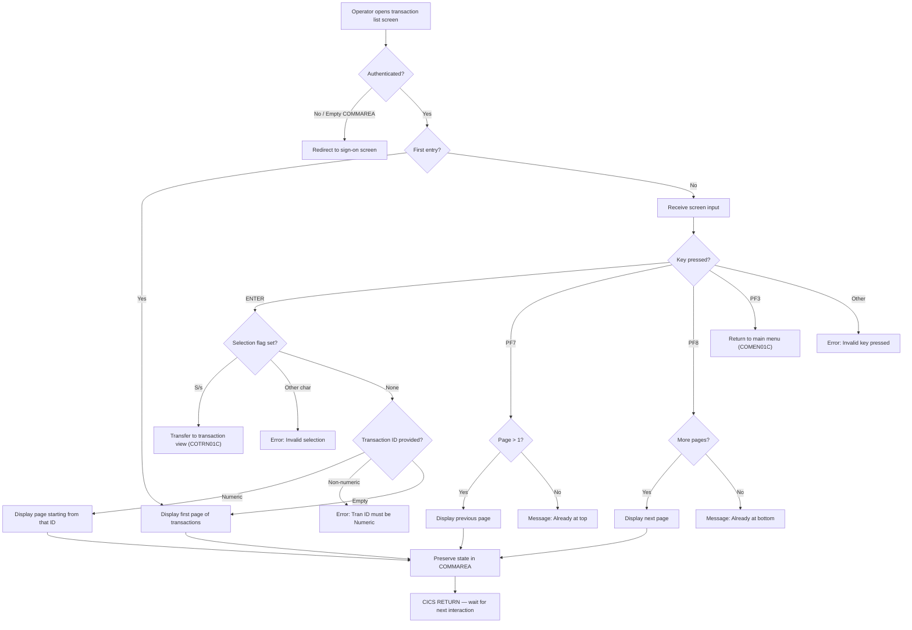

# UC-TRN-01: List Transactions

## Use Case Overview

| Field | Value |
|-------|-------|
| **Use Case ID** | UC-TRN-01 |
| **Title** | List Transactions |
| **Primary Actor** | Bank Operator |
| **Trigger** | Operator navigates to transaction list screen |
| **Precondition** | Operator is authenticated via CICS session (PSD2 Art. 97 SCA) |
| **Postcondition** | Transaction list is displayed with pagination state preserved |
| **Source Program** | `COTRN00C.cbl` |
| **CICS Transaction ID** | CT00 |

## Description

The bank operator accesses the transaction list screen to browse, filter, and select transactions. The screen displays up to 10 transactions per page with forward/backward pagination. The operator can filter by transaction ID or select a transaction for detailed viewing, which navigates to the transaction view screen (COTRN01C).

This use case is the primary entry point for transaction inquiry operations in the CardDemo system. In the COBOL system, it runs as a pseudo-conversational CICS program that preserves pagination state via COMMAREA between interactions.

## User Stories

### US-TRN-01.1: View first page of transactions

**As a** bank operator,
**I want to** see the first page of transactions (up to 10 per page) when I open the transaction list screen,
**so that** I can review recent transaction activity.

**Acceptance Criteria:**

```gherkin
Scenario: Display first page of transactions
  Given the transaction list screen is loaded for the first time
    And no transaction ID filter is provided
  When the system reads from the TRANSACT file
  Then up to 10 transactions are displayed on the screen
    And the page number is set to 1
    And the first and last transaction IDs on the page are stored for navigation
```

**Business Rules:** [TRN-BR-001 Scenario 1](/docs/business-rules/transactions/trn-br-001#scenario-1-display-first-page-of-transactions)

### US-TRN-01.2: Navigate forward through transaction pages

**As a** bank operator,
**I want to** navigate to the next page of transactions (PF8),
**so that** I can browse through the full transaction history.

**Acceptance Criteria:**

```gherkin
Scenario: Navigate forward to next page
  Given the transaction list screen displays page N
    And more transactions exist beyond the current page
  When the user presses PF8
  Then the next 10 transactions are displayed
    And the page number increments to N+1
    And the next-page flag is updated based on remaining records
```

**Business Rules:** [TRN-BR-001 Scenario 2](/docs/business-rules/transactions/trn-br-001#scenario-2-navigate-forward-to-next-page)

### US-TRN-01.3: Navigate backward through transaction pages

**As a** bank operator,
**I want to** navigate to the previous page of transactions (PF7),
**so that** I can return to previously viewed records.

**Acceptance Criteria:**

```gherkin
Scenario: Navigate backward to previous page
  Given the transaction list screen displays page N where N > 1
  When the user presses PF7
  Then the previous 10 transactions are displayed
    And the page number decrements to N-1
```

**Business Rules:** [TRN-BR-001 Scenario 3](/docs/business-rules/transactions/trn-br-001#scenario-3-navigate-backward-to-previous-page)

### US-TRN-01.4: Filter transactions by ID

**As a** bank operator,
**I want to** enter a transaction ID to jump to that position in the dataset,
**so that** I can quickly find a specific transaction.

**Acceptance Criteria:**

```gherkin
Scenario: Filter by valid transaction ID
  Given the transaction list screen is displayed
  When the user enters a numeric transaction ID in the input field
    And presses ENTER
  Then the list displays transactions starting from that ID

Scenario: Reject non-numeric transaction ID
  Given the transaction list screen is displayed
  When the user enters a non-numeric value in the transaction ID field
    And presses ENTER
  Then the message "Tran ID must be Numeric ..." is displayed
```

**Business Rules:** [TRN-BR-001 Scenarios 8–9](/docs/business-rules/transactions/trn-br-001#scenario-8-filter-by-transaction-id)

### US-TRN-01.5: Select a transaction for viewing

**As a** bank operator,
**I want to** select a transaction by entering 'S' next to it,
**so that** I can view its full details in the transaction view screen (COTRN01C).

**Acceptance Criteria:**

```gherkin
Scenario: Select a transaction for viewing
  Given the transaction list screen displays transactions
  When the user enters 'S' next to a transaction
    And presses ENTER
  Then control transfers to COTRN01C (transaction view)
    And the selected transaction ID is passed via COMMAREA

Scenario: Reject invalid selection character
  Given the transaction list screen displays transactions
  When the user enters a character other than 'S' or 's' in a selection field
    And presses ENTER
  Then the message "Invalid selection. Valid value is S" is displayed
```

**Business Rules:** [TRN-BR-001 Scenarios 6–7](/docs/business-rules/transactions/trn-br-001#scenario-6-select-a-transaction-for-viewing), [TRN-BR-008 Scenario 1](/docs/business-rules/transactions/trn-br-008#scenario-1-list-to-view-navigation)

### US-TRN-01.6: Handle boundary conditions

**As a** bank operator,
**I want to** see informative messages when I reach the first or last page,
**so that** I understand the boundaries of the dataset.

**Acceptance Criteria:**

```gherkin
Scenario: Attempt to navigate backward on first page
  Given the transaction list screen displays page 1
  When the user presses PF7
  Then the message "You are already at the top of the page..." is displayed
    And the page contents remain unchanged

Scenario: Attempt to navigate forward on last page
  Given the transaction list screen displays the last page
    And the next-page flag is 'N'
  When the user presses PF8
  Then the message "You are already at the bottom of the page..." is displayed
    And the page contents remain unchanged
```

**Business Rules:** [TRN-BR-001 Scenarios 4–5](/docs/business-rules/transactions/trn-br-001#scenario-4-attempt-to-navigate-backward-on-first-page)

## Main Flow



## Alternative Flows

| ID | Condition | Action |
|----|-----------|--------|
| AF-1 | Empty COMMAREA (EIBCALEN = 0) | Transfer to sign-on screen (COSGN00C) — prevents unauthorized access |
| AF-2 | Invalid key pressed | Display "Invalid key pressed" error, preserve current screen |
| AF-3 | Fewer than 10 records in dataset | Display only available records; no padding with stale data |
| AF-4 | Transaction ID at file boundary | STARTBR positions at start/end of file; displays boundary message |

## Data Display Format

| Field | Format | Source |
|-------|--------|--------|
| Transaction ID | 16-character alphanumeric | TRAN-ID from TRANSACT file |
| Date | MM/DD/YY | Formatted from transaction timestamp |
| Description | Variable length text | Transaction description field |
| Amount | +99999999.99 (signed, 2 decimal places) | `WS-TRAN-AMT PIC +99999999.99` |

## Pagination State (COMMAREA Contract)

State is preserved between pseudo-conversational CICS interactions via COMMAREA. The migrated system must maintain equivalent pagination state (server-side session or client-side parameters).

| Field | Type | Purpose |
|-------|------|---------|
| CDEMO-CT00-TRNID-FIRST | X(16) | First transaction ID on current page |
| CDEMO-CT00-TRNID-LAST | X(16) | Last transaction ID on current page |
| CDEMO-CT00-PAGE-NUM | 9(08) | Current page number |
| CDEMO-CT00-NEXT-PAGE-FLG | X(01) | 'Y' if more pages exist forward |
| CDEMO-CT00-TRN-SEL-FLG | X(01) | Selection flag value entered by user |
| CDEMO-CT00-TRN-SELECTED | X(16) | Transaction ID of the selected row |

**Migration note:** VSAM STARTBR/READNEXT pagination maps to SQL keyset pagination. The migrated system must preserve identical ordering and page boundaries as VSAM key-sequential access. The 10-records-per-page limit is hardcoded in COBOL and should be confirmed as a business requirement vs. screen layout constraint.

## Navigation Context

This use case participates in the transaction inter-program navigation flow documented in [TRN-BR-008](/docs/business-rules/transactions/trn-br-008):

| From | Action | To | Data Passed |
|------|--------|----|-------------|
| Main Menu (COMEN01C) | Navigate to transactions | **Transaction List (COTRN00C)** | — |
| **Transaction List (COTRN00C)** | Select transaction ('S') | Transaction View (COTRN01C) | Selected transaction ID via COMMAREA |
| Transaction View (COTRN01C) | PF5 (return) | **Transaction List (COTRN00C)** | Pagination state preserved |
| **Transaction List (COTRN00C)** | PF3 (back) | Main Menu (COMEN01C) | — |

## Regulatory Traceability

| Regulation | Article/Section | Requirement | How This Use Case Satisfies It |
|------------|----------------|-------------|-------------------------------|
| PSD2 | Art. 97 | Strong customer authentication for accessing payment account information | Transaction list is gated by CICS terminal authentication; empty COMMAREA check prevents unauthorized access. Migrated system must enforce SCA before displaying transaction data. |
| GDPR | Art. 15 | Data subject's right of access to personal data | The transaction list provides account holders (via bank operator) with access to their transaction history. Filtering supports targeted data retrieval for subject access requests. |
| FFFS 2014:5 | Ch. 7 | Requirements for information systems in financial institutions | Transaction listing provides audit trail access for authorized personnel. Pagination ensures complete access to full history. |

## Edge Cases

1. **Fewer than 10 records**: The screen displays only available records. ENDFILE response terminates the loop early. The migrated system must handle partial pages without padding empty rows with stale data.

2. **Backward navigation at page 1**: Displays "You are already at the top of the page" rather than attempting the browse. SEND-ERASE-NO flag preserves current data.

3. **Transaction ID at file boundaries**: STARTBR with HIGH-VALUES/LOW-VALUES positions at start/end of file. NOTFND response triggers boundary message.

4. **Empty COMMAREA**: EIBCALEN = 0 causes immediate transfer to sign-on screen, preventing unauthorized access.

5. **Concurrent browse operations**: STARTBR/READNEXT/ENDBR sequence is used per page display. SQL pagination must preserve the same ordering guarantees as VSAM key-sequential access.

6. **Case-insensitive selection**: Selection flag accepts both 'S' and 's'. Migrated system must preserve this case-insensitivity.

## Business Rules Cross-Reference

| Business Rule | Title | Scenarios Covered |
|--------------|-------|-------------------|
| [TRN-BR-001](/docs/business-rules/transactions/trn-br-001) | Transaction list display with pagination | US-TRN-01.1 through US-TRN-01.6 (Scenarios 1–10) |
| [TRN-BR-008](/docs/business-rules/transactions/trn-br-008) | Inter-program navigation and COMMAREA contract | US-TRN-01.5 (selection and navigation to view screen) |

---

**Template version:** 1.0
**Last updated:** 2026-02-15
