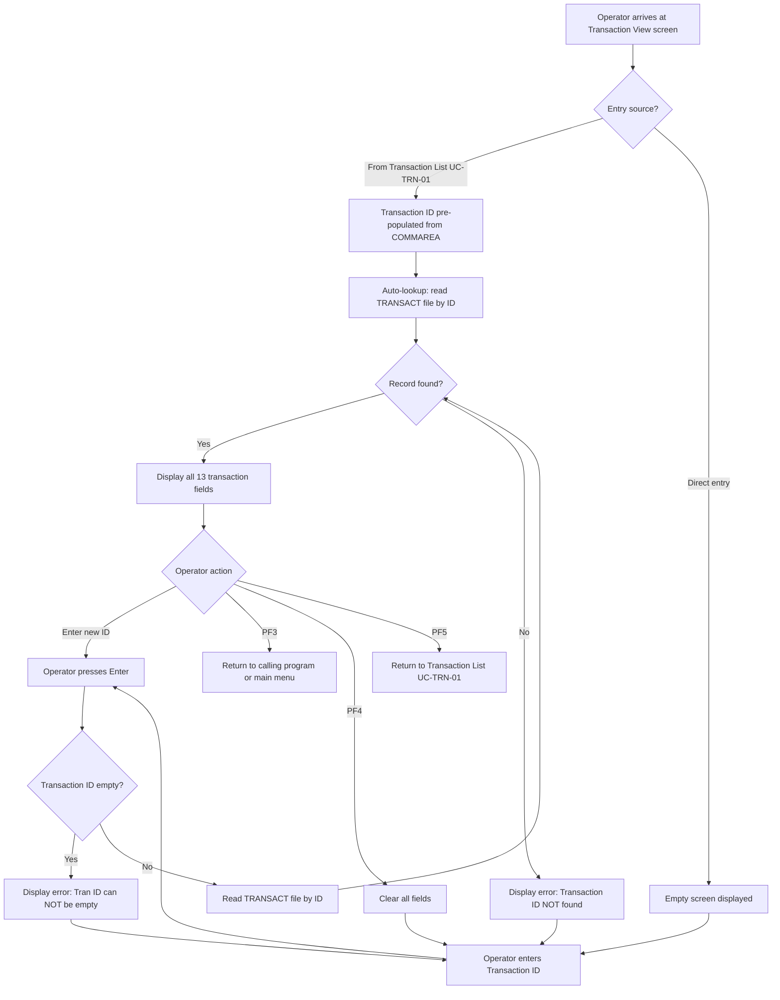

# UC-TRN-02: View Transaction Detail

## Overview

| Attribute | Value |
|-----------|-------|
| **Use Case ID** | UC-TRN-02 |
| **Title** | View Transaction Detail |
| **Domain** | Transaction Processing |
| **Primary Actor** | Bank Operator |
| **Trigger** | Operator selects a transaction from the list (UC-TRN-01) or enters a transaction ID manually |
| **Precondition** | Operator is authenticated; transaction ID is known |
| **Postcondition** | Full transaction details are displayed (13 fields) |
| **Priority** | High |
| **Source Program** | `COTRN01C.cbl` |
| **CICS Transaction ID** | CT01 |

## Business Rules Traceability

| Business Rule | Title | Source |
|---------------|-------|--------|
| [TRN-BR-002](/docs/business-rules/transactions/trn-br-002) | Transaction detail view and lookup | `COTRN01C.cbl:85-296` |
| [TRN-BR-008](/docs/business-rules/transactions/trn-br-008) | Inter-program navigation and COMMAREA contract | `COTRN00C.cbl`, `COTRN01C.cbl`, `COTRN02C.cbl` |

## Regulatory Traceability

| Regulation | Article/Section | Requirement | How This Use Case Satisfies It |
|------------|----------------|-------------|-------------------------------|
| PSD2 | Art. 45 | Users must be provided with detailed transaction information | All 13 fields including merchant details, timestamps, and amounts are displayed |
| PSD2 | Art. 97 | Strong customer authentication for payment account access | Transaction view requires authenticated session; empty COMMAREA redirects to sign-on |
| GDPR | Art. 15 | Right of access to personal data | Provides detailed transaction view including merchant data linked to cardholder |
| FFFS 2014:5 | Ch. 7 | Traceability of financial transactions | Full transaction detail including origination and processing timestamps supports audit requirements |

## Main Flow



### Steps

1. **Entry**: The operator arrives at the Transaction View screen either by selecting a transaction from the Transaction List (UC-TRN-01) or by navigating directly.
2. **Auto-lookup** (if from list): If a transaction ID was pre-selected via COMMAREA (`CDEMO-CT01-TRN-SELECTED`), the system automatically reads the TRANSACT file and displays the transaction details.
3. **Manual lookup**: The operator enters a 16-character transaction ID and presses Enter.
4. **Validation**: The system checks that the transaction ID is not empty. If empty, error message "Tran ID can NOT be empty..." is displayed.
5. **File read**: The system reads the TRANSACT file using the transaction ID as the key.
6. **Display**: If found, all 13 transaction fields are populated on screen. If not found, error message "Transaction ID NOT found..." is displayed.
7. **Navigation**: The operator can enter a new ID (Enter), return to the calling program (PF3), clear the screen (PF4), or return to the transaction list (PF5).

## Transaction Fields Displayed

| # | Field | COBOL Source Field | Data Type | Format | Description |
|---|-------|--------------------|-----------|--------|-------------|
| 1 | Transaction ID | `TRAN-ID` | `PIC X(16)` | 16-char alphanumeric | Unique transaction identifier |
| 2 | Card Number | `TRAN-CARD-NUM` | `PIC X(16)` | 16-digit card number | Associated credit card number |
| 3 | Type Code | `TRAN-TYPE-CD` | `PIC X(02)` | 2-digit code | Transaction type classification |
| 4 | Category Code | `TRAN-CAT-CD` | `PIC 9(04)` | 4-digit code | Transaction category classification |
| 5 | Source | `TRAN-SOURCE` | `PIC X(10)` | Free text | Transaction origination source |
| 6 | Amount | `TRAN-AMT` | `S9(09)V99` | `+99999999.99` (signed, 2 decimal) | Transaction amount |
| 7 | Description | `TRAN-DESC` | `PIC X(100)` | Free text | Transaction description |
| 8 | Origination Date | `TRAN-ORIG-TS` | `PIC X(26)` | Timestamp | When the transaction was originated |
| 9 | Processing Date | `TRAN-PROC-TS` | `PIC X(26)` | Timestamp | When the transaction was processed |
| 10 | Merchant ID | `TRAN-MERCHANT-ID` | `PIC 9(09)` | 9-digit numeric | Merchant identifier |
| 11 | Merchant Name | `TRAN-MERCHANT-NAME` | `PIC X(50)` | Free text | Merchant business name |
| 12 | Merchant City | `TRAN-MERCHANT-CITY` | `PIC X(50)` | Free text | Merchant city |
| 13 | Merchant ZIP | `TRAN-MERCHANT-ZIP` | `PIC X(10)` | Alphanumeric | Merchant postal code |

## User Stories

### US-TRN-02.1: Auto-lookup from list selection

> As a bank operator, I want the transaction details to load automatically when I select a transaction from the list, so that I don't have to re-enter the transaction ID.

**Acceptance Criteria:**

```gherkin
Scenario: Auto-lookup from transaction list
  Given the user selected a transaction from the transaction list (COTRN00C)
    And the selected transaction ID is passed via COMMAREA (CDEMO-CT01-TRN-SELECTED)
  When the transaction view screen loads for the first time
  Then the transaction record is automatically looked up from the TRANSACT file
    And all 13 detail fields are populated on the screen
```

**Business Rule:** [TRN-BR-002](/docs/business-rules/transactions/trn-br-002) Scenario 1, [TRN-BR-008](/docs/business-rules/transactions/trn-br-008) Scenario 6

**COBOL Source:** `COTRN01C.cbl:94-139` — First-entry logic checks `CDEMO-CT01-TRN-SELECTED` and performs auto-lookup.

---

### US-TRN-02.2: Manual transaction ID lookup

> As a bank operator, I want to enter a transaction ID manually to view its details, so that I can look up any transaction directly.

**Acceptance Criteria:**

```gherkin
Scenario: Manual transaction ID lookup
  Given the transaction view screen is displayed
  When the user enters a valid transaction ID and presses Enter
  Then the matching transaction record is read from the TRANSACT file
    And all 13 detail fields are populated on the screen
```

**Business Rule:** [TRN-BR-002](/docs/business-rules/transactions/trn-br-002) Scenario 2

**COBOL Source:** `COTRN01C.cbl:144-192` — `PROCESS-ENTER-KEY` paragraph reads the transaction ID input and performs lookup.

---

### US-TRN-02.3: View all transaction fields

> As a bank operator, I want to see all 13 transaction fields (ID, card number, type code, category code, source, amount, description, origination date, processing date, merchant ID, name, city, ZIP), so that I have complete transaction information.

**Acceptance Criteria:**

```gherkin
Scenario: All 13 fields displayed
  Given a transaction record exists in the TRANSACT file
  When the transaction is looked up (manually or from list)
  Then all 13 fields are displayed:
    | Field              | Format          |
    | Transaction ID     | X(16)           |
    | Card Number        | X(16)           |
    | Type Code          | X(02)           |
    | Category Code      | 9(04)           |
    | Source             | X(10)           |
    | Amount             | +99999999.99    |
    | Description        | X(100)          |
    | Origination Date   | Timestamp X(26) |
    | Processing Date    | Timestamp X(26) |
    | Merchant ID        | 9(09)           |
    | Merchant Name      | X(50)           |
    | Merchant City      | X(50)           |
    | Merchant ZIP       | X(10)           |

Scenario: Amount formatting precision
  Given a transaction record with TRAN-AMT stored as S9(09)V99
  When the amount is displayed on screen
  Then it is formatted as +99999999.99 (signed with 2 decimal places)
    And the original precision is preserved without rounding
```

**Business Rule:** [TRN-BR-002](/docs/business-rules/transactions/trn-br-002) Scenario 7

**COBOL Source:** `COTRN01C.cbl:176-192` — Field mapping from `TRAN-RECORD` to screen fields via COBOL MOVE statements.

---

### US-TRN-02.4: Handle transaction not found

> As a bank operator, I want to see a clear error message when a transaction ID doesn't exist, so that I know the lookup failed.

**Acceptance Criteria:**

```gherkin
Scenario: Transaction ID not found
  Given the transaction view screen is displayed
  When the user enters a transaction ID that does not exist
    And presses Enter
  Then the message "Transaction ID NOT found..." is displayed
    And the cursor is positioned on the transaction ID input field
    And no detail fields are populated

Scenario: Empty transaction ID
  Given the transaction view screen is displayed
    And the transaction ID field is empty
  When the user presses Enter
  Then the message "Tran ID can NOT be empty..." is displayed
    And the cursor is positioned on the transaction ID field
```

**Business Rule:** [TRN-BR-002](/docs/business-rules/transactions/trn-br-002) Scenarios 3, 4

**COBOL Source:** `COTRN01C.cbl:144-160` — Empty check, `COTRN01C.cbl:267-296` — `READ-TRANSACT-FILE` with NOTFND condition handling.

---

### US-TRN-02.5: Clear screen and return navigation

> As a bank operator, I want to clear the screen (PF4) or return to the transaction list (PF5) or main menu (PF3), so that I can navigate efficiently.

**Acceptance Criteria:**

```gherkin
Scenario: Clear screen with PF4
  Given the transaction view screen shows transaction details
  When the user presses PF4
  Then all detail fields are cleared to spaces
    And the cursor is positioned on the transaction ID input field

Scenario: Return to transaction list with PF5
  Given the user is on the transaction view screen
  When the user presses PF5
  Then control is transferred to the transaction list screen (COTRN00C)

Scenario: Return to calling program with PF3
  Given the user is on the transaction view screen
  When the user presses PF3
  Then control is transferred to the calling program (CDEMO-FROM-PROGRAM)
    Or to the main menu (COMEN01C) if no calling program is recorded

Scenario: Invalid key pressed
  Given the user is on the transaction view screen
  When the user presses an unsupported key
  Then the message "Invalid key pressed" is displayed
```

**Business Rule:** [TRN-BR-002](/docs/business-rules/transactions/trn-br-002) Scenarios 5, 6; [TRN-BR-008](/docs/business-rules/transactions/trn-br-008) Scenarios 2, 3

**COBOL Source:** `COTRN01C.cbl:115-139` — Key evaluation (PF3, PF4, PF5, OTHER), `COTRN01C.cbl:197-208` — Return navigation via XCTL.

## Decision Table

| User Action | Transaction ID Input | Outcome |
|-------------|---------------------|---------|
| Enter | Empty | Error: "Tran ID can NOT be empty..." |
| Enter | Valid ID (exists) | Transaction details displayed (13 fields) |
| Enter | Valid ID (not found) | Error: "Transaction ID NOT found..." |
| PF3 | N/A | Return to calling program or main menu |
| PF4 | N/A | Clear all screen fields |
| PF5 | N/A | Return to Transaction List (COTRN00C) |
| Other key | N/A | Error: "Invalid key pressed" |

## Navigation Context

This use case participates in the transaction processing navigation flow defined in [TRN-BR-008](/docs/business-rules/transactions/trn-br-008):

```
Main Menu (COMEN01C)
       │
  PF3  │
       ▼
Transaction List (COTRN00C / UC-TRN-01)
       │
  Select 'S'    PF5 (return)
       │◄──────────────┐
       ▼               │
Transaction View (COTRN01C / UC-TRN-02) ◄── This use case
       │
  PF3  │
       ▼
Return to calling program
```

The COMMAREA contract passes the selected transaction ID from the list screen to the view screen via `CDEMO-CT01-TRN-SELECTED`, enabling the auto-lookup flow.

## Edge Cases and Migration Notes

1. **UPDATE lock on READ**: The CICS READ uses the `UPDATE` keyword (`EXEC CICS READ ... UPDATE`), placing an exclusive lock on the record even though the screen is read-only. The migrated system should use a read-only query unless edit capability is planned. Requires domain expert clarification.

2. **Card number display**: The full 16-digit card number (`TRAN-CARD-NUM PIC X(16)`) is displayed unmasked in the COBOL system. Under PSD2 and GDPR, the migrated system should mask the card number (show only last 4 digits) unless the operator has explicit authorization to view full card numbers.

3. **Amount formatting**: The amount is converted via `MOVE TRAN-AMT TO WS-TRAN-AMT` where `WS-TRAN-AMT` is `PIC +99999999.99`. The migrated .NET system must use `decimal(11,2)` and preserve the exact signed display format.

4. **Pre-populated vs manual entry**: The program handles both flows — arriving from the list with a pre-selected ID, and manual ID entry. The migrated REST API should support both `GET /api/transactions/{id}` (direct lookup) and navigation from the list endpoint.

5. **Session authentication**: Empty COMMAREA (`EIBCALEN = 0`) redirects to sign-on. The migrated system must enforce equivalent authentication checks (Azure AD session validation).

## Domain Expert Review

**Status:** Awaiting domain expert review.

**Key questions for validation:**
- Should the card number be masked in the migrated system? Current COBOL displays it in full.
- Is the UPDATE lock on READ intentional (preventing concurrent modification) or a coding artifact?
- Should the view screen support editing transaction fields in the future?

---

**Template version:** 1.0
**Last updated:** 2026-02-15
